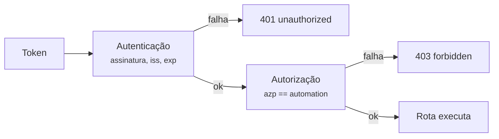

# Autenticação

**Só existe uma forma de autenticar:** `Authorization: Bearer <JWT>`,
validado contra o JWKS do issuer. `CASEHUB_AUTH_MODE` aceita um único
valor, `oidc`. `/health`, `/ready` e `/v1/auth/*` nunca exigem
credencial.

!!! info "Um valor só"
    `CASEHUB_AUTH_MODE` aceita `oidc`, e qualquer outro valor derruba a
    subida do serviço. Uma configuração errada aparece no arranque, não
    como `401` inexplicável em produção.

## Autenticação × autorização

São dois passos, e vale insistir na diferença:

- **Autenticação** responde *quem é você* — token válido, assinatura
  conferida contra o JWKS, `iss` e `exp` verificados.
- **Autorização** responde *o que você pode tocar* — o claim de
  automação do token precisa bater com a `automation` da chamada.

Nenhum caminho escapa do segundo passo: autenticar sem escopo não é
uma possibilidade.



## Onde pedir o token

**Peça à própria API do CaseHub**, em `POST /v1/auth/token`. Uma
automação não precisa conhecer o Keycloak: o endereço do realm é
configuração do serviço, não de cada consumidor em cada ambiente.

=== "Formato OAuth2 (o que o SDK usa)"

    ```bash
    curl -X POST https://casehub.interno/v1/auth/token \
      -d grant_type=client_credentials \
      -d client_id=minha-automacao -d client_secret=...
    ```

=== "JSON"

    ```bash
    curl -X POST https://casehub.interno/v1/auth/token \
      -H 'Content-Type: application/json' \
      -d '{"client_id": "minha-automacao", "client_secret": "..."}'
    ```

A resposta traz `access_token`, `expires_in`, e — quando o client tem
emissão de refresh habilitada — `refresh_token` e `refresh_expires_in`.
Renovar é `POST /v1/auth/refresh`, ou o mesmo `/v1/auth/token` com
`grant_type=refresh_token`.

!!! info "A API não assina o token"
    Ela repassa ao provedor de identidade e devolve o que vier. O
    `access_token` é o mesmo que o Keycloak entregaria a quem pedisse
    direto, com o mesmo claim de automação — existe um emissor só, e é
    ele quem controla os prazos de validade.

!!! warning "As rotas `/v1/auth/*` não exigem autenticação"
    São o caminho para obtê-la. Exigir credencial nelas seria circular.

Pedir direto ao Keycloak
(`/realms/<realm>/protocol/openid-connect/token`) continua funcionando
e é útil para depurar com a API fora do ar — mas espalha o endereço do
realm por cada configuração de cada automação, que é justamente o que
`/v1/auth/token` evita.

## O token

Precisa ser de um client `client_credentials` do Keycloak — automação
ou worker, nunca usuário interativo.

O claim que identifica a automação é `azp` por padrão
(`CASEHUB_OIDC_AUTOMATION_CLAIM`), presente em qualquer token de
`client_credentials` sem precisar de protocol mapper customizado. Na
prática: **o `client_id` do Keycloak precisa ser igual ao nome da
`automation`.**

!!! warning "Token sem o claim é 403, não acesso irrestrito"
    Um token OIDC válido mas sem o claim de automação (client mal
    configurado no Keycloak) é tratado como *sem permissão*. Falha
    fechada, sempre.

Apenas `RS256` é aceito, por allowlist explícita — o `alg` declarado no
header do token nunca é usado para escolher o algoritmo, o que fecha a
classe de ataque de confusão de algoritmo.

## Validação de `aud`

Com `CASEHUB_OIDC_AUDIENCE` **vazio** (default), a API não valida o
claim `aud`: qualquer token válido do mesmo issuer é aceito como
autenticação.

A autorização ainda segura o acesso — para alcançar uma automação é
preciso um token cujo `azp` seja exatamente o nome dela. Ainda assim é
uma camada a menos, e o serviço **avisa no log de subida** enquanto a
variável estiver vazia. Preenchê-la é parte de fechar um ambiente.

Para fechar, nesta ordem — inverter derruba os consumidores com 401:

1. Provisione um audience dedicado nos clients do Keycloak de cada
   ambiente (protocol mapper de *audience*), para os tokens passarem a
   carregar `aud`.
2. Preencha `CASEHUB_OIDC_AUDIENCE`. A validação passa a valer sozinha
   — não há mudança de código.
3. Confirme que os consumidores seguem autenticando.
4. Ligue `CASEHUB_OIDC_REQUIRE_AUDIENCE=true`: a partir daí o serviço
   **recusa subir** com o audience vazio, para a configuração não
   regredir em silêncio num deploy futuro.

## Configurando o SDK

=== "OIDC"

    ```python
    from casehub import CaseHubClient

    client = CaseHubClient(
        base_url='https://casehub.interno',
        client_id='minha-automacao',
        client_secret='...',
        token_url='https://casehub.interno/v1/auth/token',
    )
    ```

    Os três campos vêm juntos ou nenhum — configuração parcial falha na
    construção, antes de bater na rede.

!!! tip "Os três campos vêm juntos"
    `client_id`, `client_secret` e `token_url` são configurados juntos —
    passar só parte deles levanta erro na construção do cliente, antes
    de qualquer chamada de rede.
