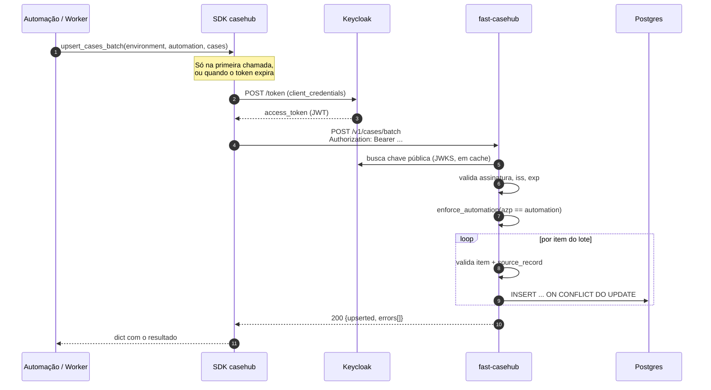
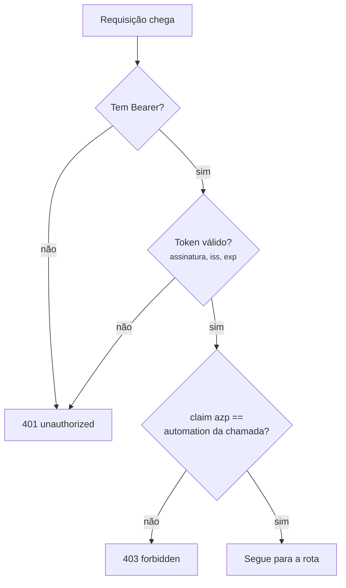
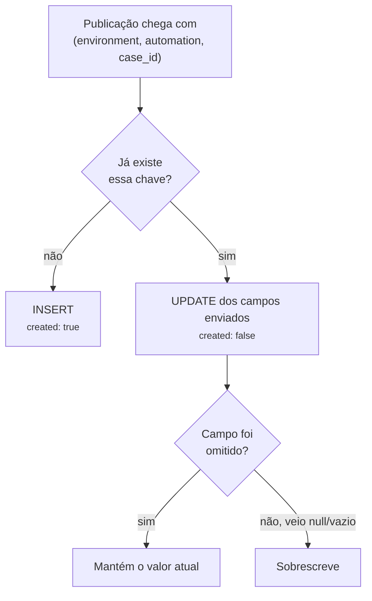
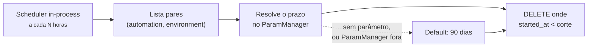
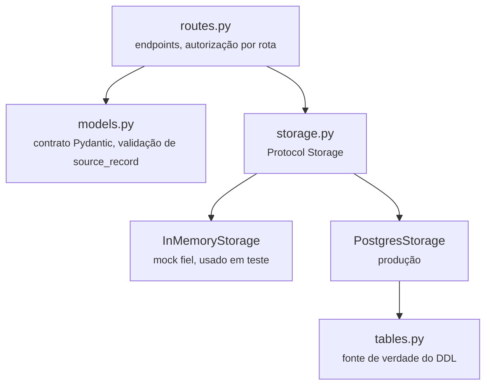

# Arquitetura

## O caminho de um caso, da fonte ao banco

!!! note "Erro por item não derruba o lote"
    Um item inválido entra em `errors[]` com o motivo, e os demais são
    gravados normalmente. O status continua 200 — o chamador precisa
    **ler `errors[]`**, não só o código HTTP.

## Autenticação e autorização

São dois passos distintos, e confundi-los é a origem da maioria das
dúvidas.

!!! info "Não existe segunda porta"
    Não há credencial alternativa: sem um Bearer válido, a resposta é
    `401`, e nenhum caminho de autenticação pula a verificação de
    automação.

Detalhes em [Autenticação](api/autenticacao.md).

## Idempotência: o que acontece ao republicar

Esta é a regra que mais confunde na integração: **omitir um campo não é
o mesmo que enviá-lo vazio.** Omitir preserva o que já estava gravado;
enviar `source_record: {}` limpa o objeto.

É o que permite uma automação republicar um caso apenas para atualizar
`status`, sem precisar reenviar o `source_record` inteiro — e é o que
faz uma recaptura preservar o `started_at` original.

## Retenção

O prazo é resolvido nesta ordem, e a primeira que existir vence:

1. `RETENTION_DAYS_<AUTOMATION>_<ENVIRONMENT>`
2. `RETENTION_DAYS_<AUTOMATION>`
3. Default de 90 dias

!!! warning "O expurgo é sempre escopado por ambiente"
    Mesmo quando só o prazo genérico está cadastrado. Sem esse escopo,
    um prazo curto configurado para limpar `dev` apagaria o histórico
    de `prod` da mesma automação, silenciosamente, no ciclo seguinte.

Detalhes em [Retenção](api/retencao.md).

## Camadas do serviço

`InMemoryStorage` não é um stub permissivo: ele implementa o mesmo
`Protocol` e é tratado como *contrato executável*. A suíte roda contra
os dois backends, então uma divergência de comportamento entre mock e
Postgres aparece como teste vermelho.
