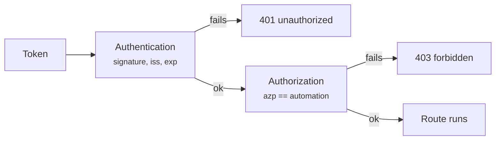

# Authentication

**Only one way to authenticate:** `Authorization: Bearer <JWT>`,
validated against the issuer's JWKS. `CASEHUB_AUTH_MODE` takes a single
value, `oidc`. `/health`, `/ready` and `/v1/auth/*` never require a
credential.

!!! danger "`apikey` and `dual` were removed on 2026-08-23"
    The `X-API-Key` header authenticated with **any non-empty string** —
    it was never compared against any secret — and **skipped
    per-automation authorization**. Together: anyone who knew the header
    name read and wrote cases of any automation in any environment.

    A service configured with `CASEHUB_AUTH_MODE=apikey` or `dual`
    **refuses to start**, and the message says what to do. Failing at
    startup is deliberate — the alternative is staying up accepting any
    string.

## Authentication × authorization

They are two steps, and the difference is worth insisting on:

- **Authentication** answers *who you are* — a valid token, signature
  checked against the JWKS, `iss` and `exp` verified.
- **Authorization** answers *what you may touch* — the token's automation
  claim has to match the call's `automation`.

No path escapes the second step. That is exactly what the removed
`apikey` did: it authenticated with no scope at all.



## Where to request the token

**Ask the CaseHub API itself**, at `POST /v1/auth/token`. An automation
does not need to know about Keycloak: the realm address is the
service's configuration, not something every consumer carries in every
environment.

=== "OAuth2 form (what the SDK sends)"

    ```bash
    curl -X POST https://casehub.internal/v1/auth/token \
      -d grant_type=client_credentials \
      -d client_id=my-automation -d client_secret=...
    ```

=== "JSON"

    ```bash
    curl -X POST https://casehub.internal/v1/auth/token \
      -H 'Content-Type: application/json' \
      -d '{"client_id": "my-automation", "client_secret": "..."}'
    ```

The response carries `access_token`, `expires_in` and — when the client
has refresh issuance enabled — `refresh_token` and
`refresh_expires_in`. Renewing is `POST /v1/auth/refresh`, or the same
`/v1/auth/token` with `grant_type=refresh_token`.

!!! info "The API does not sign the token"
    It forwards to the identity provider and returns what comes back.
    The `access_token` is the very one Keycloak would hand to a direct
    caller, carrying the same automation claim — there is a single
    issuer, and it is the one that controls the lifetimes.

!!! warning "The `/v1/auth/*` routes require no authentication"
    They are how you obtain it. Requiring a credential there would be
    circular.

Requesting straight from Keycloak
(`/realms/<realm>/protocol/openid-connect/token`) still works and helps
when debugging with the API down — but it spreads the realm address
across every automation's configuration, which is exactly what
`/v1/auth/token` removes.

## The token

It has to belong to a Keycloak `client_credentials` client — an automation
or a worker, never an interactive user.

The claim that identifies the automation is `azp` by default
(`CASEHUB_OIDC_AUTOMATION_CLAIM`), present in any `client_credentials` token
without needing a custom protocol mapper. In practice: **the Keycloak
`client_id` has to equal the `automation` name.**

!!! warning "A token without the claim is a 403, not unrestricted access"
    A valid OIDC token with no automation claim (a client misconfigured in
    Keycloak) is treated as *not permitted*. Fails closed, always.

Only `RS256` is accepted, by an explicit allowlist — the `alg` declared in
the token header is never used to choose the algorithm, which closes off the
algorithm-confusion class of attack.

## The `X-API-Key` header authenticates nothing

It existed until 2026-08-23 and was removed. If a running service still
accepts it, that service is an older build — and in it **any string
reaches any automation**.

!!! warning "How to tell"
    A call carrying only `X-API-Key`, with no `Authorization`, must
    answer `401`. If it answers `200`, the API is old.

## Validating `aud`

With `CASEHUB_OIDC_AUDIENCE` **empty** (the default), the API does not
validate the `aud` claim: any valid token from the same issuer is accepted
as authentication.

Authorization still holds access — reaching an automation requires a token
whose `azp` is exactly its name. It is still one layer less, and the service
**warns in the startup log** while the variable is empty. Filling it in is
part of hardening an environment.

To close it, in this order — inverting it knocks consumers out with 401s:

1. Provision a dedicated audience on the Keycloak clients of each
   environment (an *audience* protocol mapper), so tokens start carrying
   `aud`.
2. Fill in `CASEHUB_OIDC_AUDIENCE`. Validation takes effect on its own —
   there is no code change.
3. Confirm that consumers are still authenticating.
4. Turn on `CASEHUB_OIDC_REQUIRE_AUDIENCE=true`: from then on the service
   **refuses to start** with an empty audience, so the configuration cannot
   regress silently in a future deploy.

## Configuring the SDK

=== "OIDC"

    ```python
    from casehub import CaseHubClient

    client = CaseHubClient(
        base_url='https://casehub.interno',
        client_id='minha-automacao',
        client_secret='...',
        token_url='https://casehub.interno/v1/auth/token',
    )
    ```

    The three fields come together or not at all — a partial configuration
    fails at construction, before touching the network.

!!! tip "`api_key` in the SDK no longer works"
    The parameter still exists in the library, but the API rejects the
    key. A client configured with only `api_key` gets `401` on every
    call.
