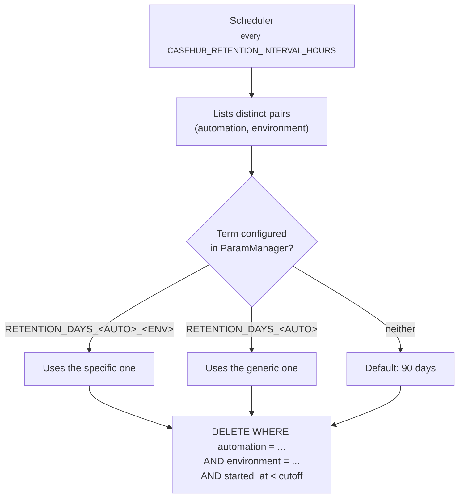

# Retention

A scheduler runs inside the API process itself and purges expired cases. It
comes up and goes down with the application — there is no separate worker.

## Where the term is configured

In **ParamManager**, under fast-casehub's own namespace
(`CASEHUB_RETENTION_PARAM_MANAGER_APP_NAME`, default `casehub`) — not under
the namespace of each consuming automation.

Precedence, and the first one that exists wins:

1. `RETENTION_DAYS_<AUTOMATION>_<ENVIRONMENT>`
2. `RETENTION_DAYS_<AUTOMATION>`
3. A default of **90 days**

The automation name is sanitized to the `UPPERCASE_WITH_UNDERSCORE`
convention: any character outside `[A-Z0-9_]` becomes `_`.

| `automation` | Generic parameter | Per environment |
|---|---|---|
| `minha-automacao` | `RETENTION_DAYS_MINHA_AUTOMACAO` | `RETENTION_DAYS_MINHA_AUTOMACAO_DEV` |

## The purge is always scoped by environment

!!! danger "Why this matters"
    Even when **only** the generic term is configured, the `DELETE` filters
    by `environment`.

    Without that scope, a short term set up to clean `dev` during a test
    would also wipe the `prod` cases of the same automation — silently, on
    the scheduler's next cycle, with up to 24 hours between the
    configuration and the damage.

## A failure does not bring the cycle down

If purging one `(automation, environment)` pair fails — an unstable
Postgres, a ParamManager that is down — the error is logged and the cycle
**moves on to the next**. Same spirit as "a per-item error does not bring the
batch down".

An unreachable ParamManager is not treated as an error: `get_param` never
propagates a network exception, so that path falls into the 90-day default
along with the ordinary "parameter was never configured" case.

!!! warning "Practical consequence"
    A ParamManager that is down makes **every** automation fall back to 90
    days, with no visible error. If you configured a shorter term and it
    seems not to be taking effect, check connectivity to ParamManager before
    suspecting the parameter.

## Turning it off

`CASEHUB_RETENTION_ENABLED=false` — no scheduler is created and no
ParamManager is instantiated.

It is the default in environments with no reachable ParamManager: the test
suite, CI, and the compose `uat` profile.

## Observability

On every run, the `casehub.retention.deleted` metric is incremented with the
`automation` and `environment` labels.

!!! note "The `environment` label is new"
    It was added when the purge became scoped by environment. Queries
    filtering only by `automation` still work, but the series is now split by
    environment — a dashboard that showed one line per automation now shows
    one per automation × environment.
