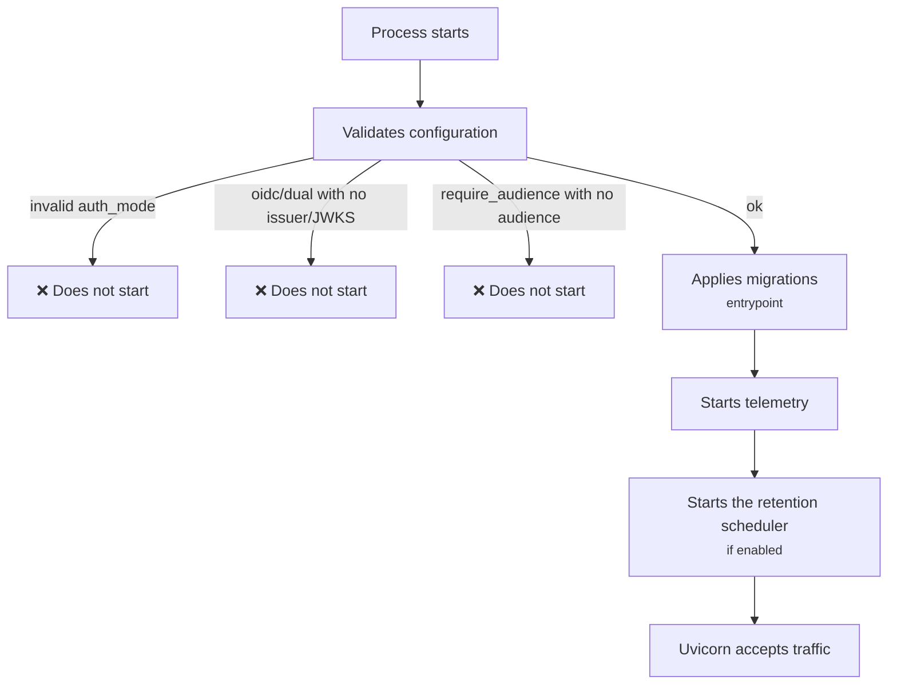

# Deploy

## How the service starts

!!! tip "Failing at startup is the desired behaviour"
    Incomplete configuration kills the process instead of starting in a
    degraded state. A deploy that does not complete is far cheaper than a
    service in the air accepting requests it should not.

## Compose profiles

| Profile | What it starts |
|---|---|
| `uat` | API + Postgres + Keycloak — a complete, disposable local stack. |
| `prod` | The API only, pointing at infrastructure that already exists. |

docker compose --profile uat up -d

✔ 3 containers running

!!! warning "The `.env` has to exist first"
    Compose reads it through `env_file`. Without the file, the values fall
    back to development defaults — database credentials included.

## Reproducible build

The image installs from `requirements.lock`, versioned in the repository,
and only then installs the package with `--no-deps`.

!!! note "Why two steps"
    Installing straight from `pyproject.toml` would resolve the `>=` ranges
    at build time — two builds of the same commit would produce different
    images, and a dependency published in between would reach production
    without anyone having decided so.

To regenerate the lock, always in a Linux container (which is what the image
targets):

docker run --rm -v "$PWD:/src" -w /src python:3.13-slim \
  sh -c "pip install pip-tools && pip-compile --no-header \
  --strip-extras --output-file=requirements.lock pyproject.toml"

!!! danger "Do not regenerate the lock on Windows"
    The platform markers resolved would be Windows ones, and the Linux image
    would get the wrong set of packages.

## Migrations

Applied automatically by the image entrypoint, before the process accepts
traffic. `tables.py` is the source of truth for the DDL: change the table
there and then generate the Alembic revision — never write the revision by
hand from the database.

## Variables per environment

| | dev | homolog / prod |
|---|---|---|
| `CASEHUB_STORAGE` | `memory` or `postgres` | `postgres` |
| `CASEHUB_AUTH_MODE` | `apikey` (local) | `oidc` |
| `CASEHUB_OIDC_*` | from the local Keycloak | from the corporate Keycloak |
| `CASEHUB_RETENTION_ENABLED` | `false` | `true` |

!!! danger "`apikey` never in a shared environment"
    It accepts any string as a credential and applies no per-automation
    authorization. See [Authentication](../api/autenticacao.md).

## Pipeline

| Stage | What runs |
|---|---|
| `lint` | `ruff check` and `ruff format --check`. |
| `test` | The suite against the mock **and** a real Postgres. |
| `build` | Validates that the image builds. |
| `security` | `pip-audit` (blocking) and `gitleaks` over the full history. |

!!! note "Why gitleaks needs `GIT_DEPTH: 0`"
    The default shallow clone only sees recent commits. A secret introduced
    before that would go unnoticed — the scan is only worth anything over
    the whole history.
