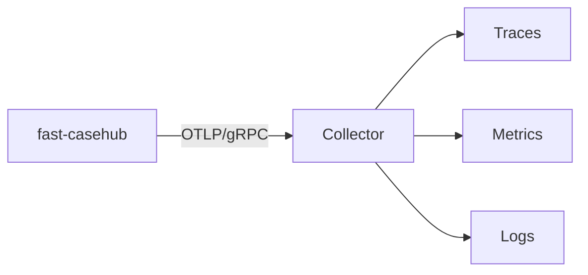

# Observability

Traces, metrics and logs leave over **OTLP/gRPC** to a collector. The
configuration uses the standard OpenTelemetry specification variables, read
by the SDK itself — there is no configuration of our own in code.

| Variable | For what |
|---|---|
| `OTEL_EXPORTER_OTLP_ENDPOINT` | Collector address. |
| `OTEL_SERVICE_NAME` | Service name in traces. |
| `OTEL_RESOURCE_ATTRIBUTES` | E.g. `deployment.environment=prod`. |
| `OTEL_SDK_DISABLED` | `true` turns everything off — no exporter is created. |

`/health` and `/ready` are excluded from instrumentation: liveness probes
hit every few seconds and would fill the traces with noise carrying no
information.

## Metrics

Automatic instrumentation emits the first two; `casehub.up` and
`casehub.retention.deleted` are the ones written by the service.

| Metric | Type | Labels | What it counts |
|---|---|---|---|
| `http.server.request.duration` | histogram | route, method, status | Latency per request. The `_count` is what answers "how many requests today/yesterday/this week". |
| `http.server.active_requests` | gauge | route, method | Requests in flight. The average answers "how many clients at once". |
| `casehub.up` | gauge | — | Heartbeat: `1` while the process is up. |
| `casehub.retention.deleted` | counter | `automation`, `environment` | Cases purged per job run. |

!!! tip "`casehub.up` is read by absence, not by value"
    It is `1` whenever it exists — never `0`. The signal that the service is
    down is the **missing data** in the series, not a drop in value. An
    alert written as `casehub.up == 0` never fires; the right thing is to
    alert on missing samples in the window.

!!! note "The HTTP metrics do not count the probes"
    `/health` and `/ready` are outside instrumentation, as said above. That
    is what you want — but it means `http.server.request.duration` measures
    real traffic and does not match the volume the load balancer sees.

!!! note "The `environment` label was added"
    It came in when the purge became scoped by environment. Queries
    filtering only by `automation` still work — but the series is now split
    by environment, so a dashboard that showed one line per automation now
    shows one per automation × environment.

## What does not show up in traces

!!! danger "`source_record` is not captured, and that is on purpose"
    The HTTP instrumentation does not capture request bodies, and no span or
    log records the content of `source_record`. Since it may carry sensitive
    data, capturing it would take that data to the observability backend — a
    place with entirely different access and retention policies from the
    database's.

    The product decision about storing sensitive data covers **storage**,
    not observability.

!!! warning "`CASEHUB_DB_ECHO=true` breaks this"
    Turning SQLAlchemy's echo on sends the SQL — with its parameters,
    `source_record` included — to stdout. It is useful in local debugging
    and **must not be turned on in a shared environment**.

In the same way, the 500 error response never carries the detail of the
failure: the exception goes only to the correlated log. See
[Errors](../api/erros.md#internal-error).

## Correlation

Logs come out correlated by `trace_id`/`span_id`, so an error seen in the
log leads to the request's full trace.

To correlate with Temporal, the case's `temporal_workflow_id` and
`temporal_run_id` fields tie the record to the execution that produced it.
They are optional and have no foreign key — they are for investigation, not
for referential integrity.

## What to watch

| Signal | Why it matters |
|---|---|
| Absence of `casehub.up` | The process is not reporting — the service is down, or telemetry is broken. |
| `/ready` answering 503 | The database went down; the service is up but unusable. |
| Rate of 401/403 | An expired token, a badly provisioned client, or an automation trying someone else's scope. |
| Non-empty `errors[]` in batches | A failure **on the publisher's side** — it does not show up as an HTTP error. |
| The `aud` warning at startup | `aud` validation is not active in this environment. See the plan in [Authentication](../api/autenticacao.md#validating-aud). |
| `casehub.retention.deleted` off expectation | A badly configured term, or an unreachable ParamManager making everything fall back to the 90-day default. |

!!! danger "A batch with a rejected item produces no HTTP error"
    It is the most common blind spot: the 5xx dashboard stays clean while
    cases are discarded. If you only monitor HTTP status, you are not
    monitoring publication — instrument `errors[]` on the publisher's side.
