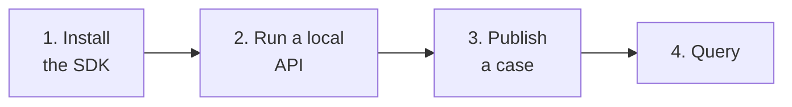

# Getting started

The shortest path between having nothing and having a case stored.



## 1. Install the SDK

<div class="pm-terminal" data-pm-terminal data-pm-command="pip install casehub">
<div class="termynal" data-termynal data-ty-startDelay="500" data-ty-typeDelay="45" data-ty-lineDelay="800">
<span data-ty="input">pip install casehub</span>
<span data-ty="progress"></span>
</div>
</div>

## 2. Run a local API

To try it out without depending on any environment, the in-memory mock will
do — it implements the same contract:

<div class="pm-terminal" data-pm-terminal data-pm-command="python -m casehub_api --storage memory">
<div class="termynal" data-termynal data-ty-startDelay="500" data-ty-typeDelay="45" data-ty-lineDelay="800">
<span data-ty="input">python -m casehub_api --storage memory</span>
<span data-ty>INFO:     Uvicorn running on http://127.0.0.1:8080</span>
</div>
</div>

!!! tip "The mock requires a credential, like the service"
    Set `CASEHUB_OIDC_ISSUER`/`CASEHUB_OIDC_JWKS_URL` before starting it
    and use a signed token. For a local test, serving the JWKS over local
    HTTP and signing a JWT takes only a few lines — see
    [Authentication](api/autenticacao.md).

## 3. Publish a case

```python
from casehub import CaseHubClient

with CaseHubClient(
    base_url='http://127.0.0.1:8080',
    client_id='MY_AUTOMATION',
    client_secret='...',
    token_url='http://127.0.0.1:8080/v1/auth/token',
) as client:
    resposta = client.upsert_case(
        environment='dev',
        automation='MINHA_AUTOMACAO',
        case_id='caso-1',
        status='aberto',
        started_at='2026-08-20T09:00:00-03:00',
        source_record={'referencia': 'REF-12345', 'origem': 'lote-a'},
    )

print(resposta)   # {'created': True}
```

!!! warning "`started_at` needs a timezone"
    `'2026-08-20T09:00:00'` is rejected with a 400. The contract requires an
    *aware* datetime — without one there is no way to know which real moment
    the case refers to.

## 4. Query

```python
caso = client.get_case(
    environment='dev',
    automation='MINHA_AUTOMACAO',
    case_id='caso-1',
)
print(caso['status'], caso['source_record'])
```

## 5. Republish and watch idempotency

Run the same `upsert_case` from step 3 again. The answer changes to
`{'created': False}` — and there is still **one** case.

Now republish changing only `status`, without sending `source_record`:

```python
client.upsert_case(
    environment='dev',
    automation='MINHA_AUTOMACAO',
    case_id='caso-1',
    status='concluido',
    started_at='2026-08-20T09:00:00-03:00',
)
```

Query again: `status` changed and **`source_record` is still there**.
Omitting a field keeps the current value — which is what lets you update a
case's life cycle without carrying the whole payload every time.

## Next steps

- [Tutorial](tutorial.md) — a complete batch import flow.
- [Authentication](api/autenticacao.md) — how to obtain and use the token.
- [Endpoints](api/endpoints.md) — the contract field by field.
