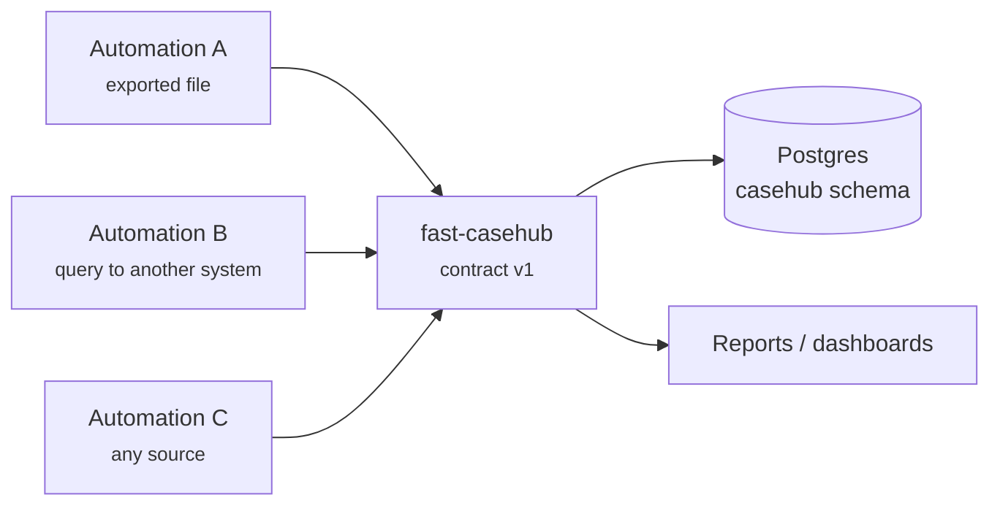
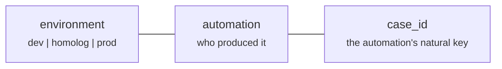
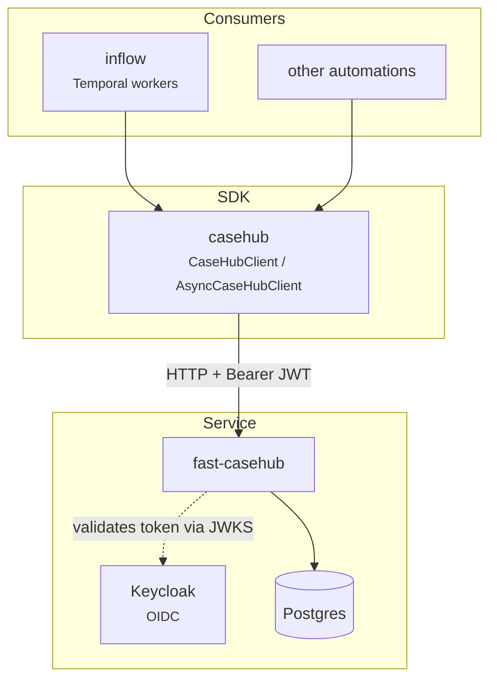

# What is CaseHub

CaseHub is the **single point of access** to the record of cases imported by
automations. An RPA automation or a Temporal Workflow reads its own data
source, builds the cases and publishes them here — no automation connects
straight to Postgres.

## The contract is domain-agnostic

This is the structural decision of the service, and it explains almost
everything else in the design.

CaseHub **does not know** what the automation calls a case, and does not
need to: to it, a case is whatever unit the automation decided to record.
It knows only the identity (`environment`, `automation`, `case_id`), a
handful of life-cycle fields (`status`, `started_at`, `finished_at`) and a
free-form JSON object called `source_record`, where each automation's
specific data travels with no schema the service knows about.

The practical consequence: **adding a new automation requires no change to
CaseHub at all.** No migration, no new field, no deploy. The automation
starts publishing and that is it.

The accepted cost is that the service does not validate the content of
`source_record` — a mistake in how the automation assembled it is stored
without complaint. That validation is the publisher's responsibility.

## The key of a case

A case's identity always has three parts:

`case_id` is the case's **natural key** in the source system — which is what
makes publishing idempotent. Re-sending the same case updates the existing
row instead of creating a new one.

!!! warning "Publishing without `case_id` gives up idempotency"
    In a batch, `case_id` is optional: omitted, the API generates an
    `auto-<hex>`. Since there is no natural key to deduplicate against,
    re-sending the same payload creates a new row every time. Only use this
    when the source genuinely has no key — and know that reprocessing will
    duplicate.

## What CaseHub deliberately does not do

These absences are recorded decisions, not gaps:

**It does not control execution, attempt or treatment round.** A second
table for that existed and was removed: it duplicated what Temporal already
solves natively (`run_id`, `RetryPolicy`, deduplication by `WorkflowID`).
The rule that stuck: *what Temporal already does well is not reimplemented
here.* In exchange, the case carries `temporal_workflow_id` and
`temporal_run_id` — optional, for correlation only, with no foreign key.

**It orchestrates nothing.** It does not trigger automations, does not
schedule, does not notify. It is a queryable record.

**It does not interpret `source_record`.** Neither to validate nor to index
field by field — querying by content exists (`f.<path>`), but it is generic
over the JSON, with no declared schema.

## Ecosystem

!!! info "Use the SDK, not your own HTTP client"
    The SDK handles authentication (including OIDC token renewal), error
    normalization and a persistent HTTP session. An ad-hoc client has to
    reimplement all of that and tends to drift from the contract at the
    first change. See [SDK](sdk/cliente.md).
