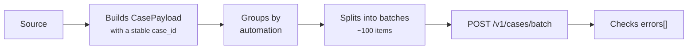

# Tutorial

A complete import flow: read a source, build the cases, publish in batches
and check what was rejected.

## The scenario

An automation reads a tabular source — an exported file, the result of a
query, a report — and needs to record each row as a case. The source may
have tens of thousands of rows, and the process may be re-run: reprocessing
must not duplicate anything.



## 1. A stable key

This is the step that decides whether reprocessing is safe.

```python
import hashlib

def montar_case_id(linha: dict) -> str:
    """Hash das colunas que identificam a linha na origem."""
    chave = '|'.join([
        str(linha['referencia']).strip().upper(),
        str(linha['origem']).strip().upper(),
        str(linha['item']).strip().upper(),
    ])
    return hashlib.sha256(chave.encode('utf-8')).hexdigest()[:32]
```

!!! danger "Never put a timestamp in the key"
    If `case_id` changes on every read, the same physical item becomes a new
    case every time — and the database fills up with duplicates of the same
    record.

    Use only columns that **identify** the row, never the ones that describe
    *when* it was seen.

!!! tip "Normalize before hashing"
    `' 12345 '` and `'12345'` have to produce the same key. Without
    `strip()`/`upper()`, a variation in whitespace or case at the source
    creates a duplicate case.

## 2. Building the items

```python
def montar_item(linha: dict) -> dict:
    return {
        'case_id': montar_case_id(linha),
        'status': 'aberto',
        'started_at': '2026-08-20T09:00:00-03:00',
        'batch_ref': linha['origem'],
        'source_schema': 'origem.v1',
        'source_record': linha,      # o dado bruto, como veio
    }
```

`source_record` receives the whole row. The service does not interpret the
content — whoever queries later is the one who knows what each key means.

!!! warning "`source_record` is stored as it arrived"
    Personal data included, if the source has any. That is usually a
    conscious product decision, but it needs to **be** a decision — not the
    result of dumping the row without looking.

## 3. Publishing in batches

```python
from casehub import CaseHubClient

BLOCO = 100

def publicar(linhas: list[dict]) -> None:
    itens = [montar_item(linha) for linha in linhas]

    with CaseHubClient(
        base_url='https://casehub.interno',
        client_id='minha-automacao',
        client_secret='...',
        token_url='https://casehub.internal/v1/auth/token',
    ) as client:
        for inicio in range(0, len(itens), BLOCO):
            bloco = itens[inicio:inicio + BLOCO]
            resposta = client.upsert_cases_batch(
                environment='prod',
                automation='minha-automacao',
                cases=bloco,
            )
            conferir(resposta, bloco)
```

!!! tip "Why split into blocks"
    A giant batch is rejected by the service ceiling, takes memory on both
    sides and, if it fails, brings everything down at once. Blocks of ~100
    give incremental progress and a small blast radius.

## 4. Checking what was rejected

The step integrations tend to forget:

```python
import logging

logger = logging.getLogger(__name__)

def conferir(resposta: dict, bloco: list[dict]) -> None:
    if resposta['errors']:
        logger.error(
            'lote parcial: %s de %s gravados; recusados: %s',
            resposta['upserted'],
            len(bloco),
            resposta['errors'],
        )
```

!!! danger "200 does not mean the whole batch was stored"
    An invalid item lands in `errors[]` and the rest is stored normally. An
    automation that only checks the HTTP status considers everything
    published — while cases were discarded in silence.

## 5. Re-running

Run the import again over the same source. The total number of cases **does
not change**: every `case_id` already exists, so each publication becomes an
update.

That is what makes reprocessing safe — and it is a direct consequence of
step 1.

## Querying afterwards

```python
pagina = client.list_cases(
    environment='prod',
    automation='minha-automacao',
    status='aberto',
    source_filters={'referencia': 'REF-12345'},
    include='source_record',
    page_size=100,
)

for caso in pagina['items']:
    print(caso['case_id'], caso['source_record']['origem'])
```

## In asynchronous code

Inside a Temporal Activity, or any coroutine, switch to the asynchronous
client — the synchronous one would block the whole process's event loop.
See [Asynchronous client](sdk/assincrono.md).

```python
from casehub import AsyncCaseHubClient

async with AsyncCaseHubClient(...) as client:
    await client.upsert_cases_batch(...)
```
