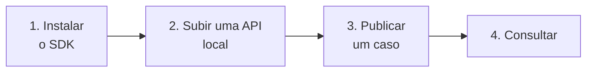

# Primeiros passos

O caminho mais curto entre não ter nada e ter um caso gravado.



## 1. Instale o SDK

<div class="pm-terminal" data-pm-terminal data-pm-command="pip install casehub">
<div class="termynal" data-termynal data-ty-startDelay="500" data-ty-typeDelay="45" data-ty-lineDelay="800">
<span data-ty="input">pip install casehub</span>
<span data-ty="progress"></span>
</div>
</div>

## 2. Suba uma API local

Para experimentar sem depender de nenhum ambiente, o mock in-memory
serve — ele implementa o mesmo contrato:

<div class="pm-terminal" data-pm-terminal data-pm-command="python -m casehub_api --storage memory">
<div class="termynal" data-termynal data-ty-startDelay="500" data-ty-typeDelay="45" data-ty-lineDelay="800">
<span data-ty="input">python -m casehub_api --storage memory</span>
<span data-ty>INFO:     Uvicorn running on http://127.0.0.1:8080</span>
</div>
</div>

!!! tip "O mock exige credencial, como o serviço"
    Configure `CASEHUB_OIDC_ISSUER`/`CASEHUB_OIDC_JWKS_URL` antes de
    subir e use um token assinado. Para um teste local, servir o JWKS
    por HTTP local e assinar um JWT resolve em poucas linhas — ver
    [Autenticação](api/autenticacao.md).

## 3. Publique um caso

```python
from casehub import CaseHubClient

with CaseHubClient(
    base_url='http://127.0.0.1:8080',
    client_id='MINHA_AUTOMACAO',
    client_secret='...',
    token_url='http://127.0.0.1:8080/v1/auth/token',
) as client:
    resposta = client.upsert_case(
        environment='dev',
        automation='MINHA_AUTOMACAO',
        case_id='caso-1',
        status='aberto',
        started_at='2026-08-20T09:00:00-03:00',
        source_record={'referencia': 'REF-12345', 'origem': 'lote-a'},
    )

print(resposta)   # {'created': True}
```

!!! warning "`started_at` precisa de timezone"
    `'2026-08-20T09:00:00'` é recusado com 400. O contrato exige um
    datetime *aware* — sem isso, não há como saber a que momento real o
    caso se refere.

## 4. Consulte

```python
caso = client.get_case(
    environment='dev',
    automation='MINHA_AUTOMACAO',
    case_id='caso-1',
)
print(caso['status'], caso['source_record'])
```

## 5. Republique e veja a idempotência

Rode o mesmo `upsert_case` do passo 3 outra vez. A resposta muda para
`{'created': False}` — e o caso continua sendo **um só**.

Agora republique alterando só o `status`, sem enviar `source_record`:

```python
client.upsert_case(
    environment='dev',
    automation='MINHA_AUTOMACAO',
    case_id='caso-1',
    status='concluido',
    started_at='2026-08-20T09:00:00-03:00',
)
```

Consulte de novo: `status` mudou e **`source_record` continua lá**.
Omitir um campo mantém o valor atual — é o que permite atualizar o
ciclo de vida de um caso sem carregar o payload inteiro a cada vez.

## Próximos passos

- [Tutorial](tutorial.md) — um fluxo completo de importação em lote.
- [Autenticação](api/autenticacao.md) — como obter e usar o token.
- [Endpoints](api/endpoints.md) — o contrato campo a campo.
