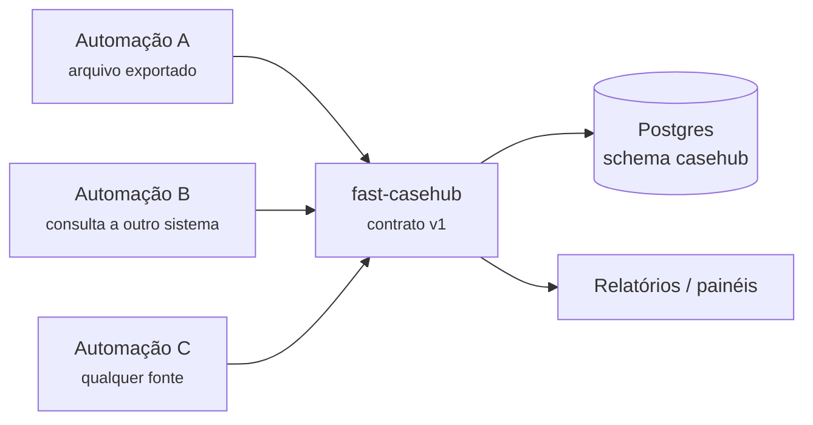
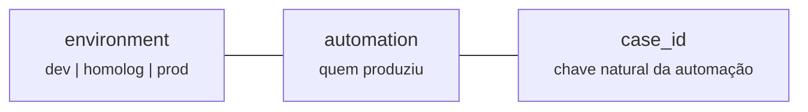
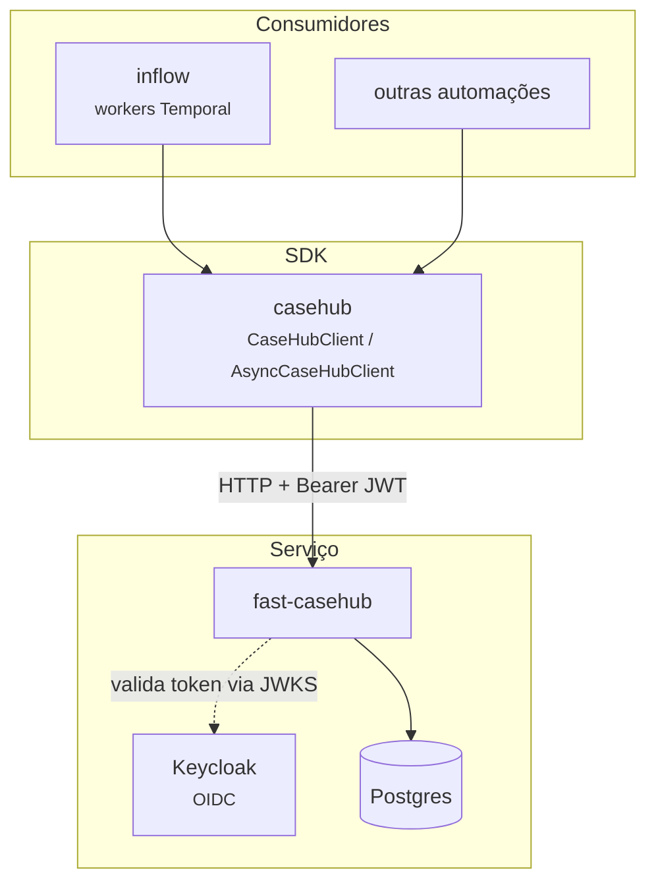

# O que é o CaseHub

O CaseHub é o **ponto único de acesso** ao registro de casos importados
por automações. Uma automação RPA ou um Workflow do Temporal lê a fonte
de dados dela, monta os casos e os publica aqui — nenhuma automação
conecta direto no Postgres.

## O contrato é agnóstico de domínio

Esta é a decisão estruturante do serviço, e ela explica quase todo o
resto do desenho.

O CaseHub **não sabe** o que a automação chama de caso, e não precisa
saber: para ele, um caso é a unidade que a automação decidiu registrar.
Ele conhece apenas a identidade
(`environment`, `automation`, `case_id`), um punhado de campos de ciclo
de vida (`status`, `started_at`, `finished_at`) e um objeto JSON livre
chamado `source_record`, onde o dado específico de cada automação
trafega sem schema conhecido pelo serviço.

A consequência prática: **adicionar uma automação nova não exige
mudança nenhuma no CaseHub.** Não há migração, não há campo novo, não
há deploy. A automação começa a publicar e pronto.

O custo aceito é que o serviço não valida o conteúdo de `source_record`
— um erro de montagem do lado da automação é gravado sem reclamação.
Essa validação é responsabilidade de quem publica.

## A chave de um caso

A identidade de um caso tem três partes, sempre:

`case_id` é a **chave natural** do caso na fonte de origem — o que
torna a publicação idempotente. Reenviar o mesmo caso atualiza a linha
existente em vez de criar uma nova.

!!! warning "Publicar sem `case_id` abre mão de idempotência"
    No lote, `case_id` é opcional: omitido, a API gera um `auto-<hex>`.
    Como não existe chave natural contra a qual deduplicar, reenviar o
    mesmo payload cria uma linha nova a cada vez. Só use isso quando a
    fonte realmente não tiver chave — e saiba que reprocessar vai
    duplicar.

## O que o CaseHub deliberadamente não faz

Estas ausências são decisões registradas, não lacunas:

**Não controla execução, tentativa ou rodada de tratamento.** Existiu
uma segunda tabela para isso e ela foi removida: duplicava o que o
Temporal já resolve nativamente (`run_id`, `RetryPolicy`, deduplicação
por `WorkflowID`). A regra que ficou: *o que o Temporal já fornece bem
não é reimplementado aqui.* Em troca, o caso carrega
`temporal_workflow_id` e `temporal_run_id` — opcionais, apenas para
correlação, sem chave estrangeira.

**Não orquestra nada.** Não dispara automação, não agenda, não
notifica. É um registro consultável.

**Não interpreta `source_record`.** Nem para validar, nem para indexar
campo por campo — a consulta por conteúdo existe (`filter`), mas
é genérica sobre o JSON, sem schema declarado.

## Ecossistema

!!! info "Use o SDK, não um cliente HTTP próprio"
    O SDK trata autenticação (incluindo renovação de token OIDC),
    normalização de erro e sessão HTTP persistente. Um cliente ad-hoc
    precisa reimplementar tudo isso e tende a divergir do contrato na
    primeira mudança. Ver [SDK](sdk/cliente.md).
