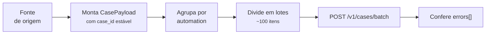

# Tutorial

Um fluxo completo de importação: ler uma fonte, montar os casos,
publicar em lote e conferir o que foi recusado.

## O cenário

Uma automação lê uma fonte tabular — um arquivo exportado, o resultado
de uma consulta, um relatório — e precisa registrar cada linha como um
caso. A fonte pode ter dezenas de milhares de linhas, e o processo pode
ser reexecutado: reprocessar não pode duplicar nada.



## 1. Uma chave estável

Este é o passo que decide se o reprocessamento é seguro.

```python
import hashlib

def montar_case_id(linha: dict) -> str:
    """Hash das colunas que identificam a linha na origem."""
    chave = '|'.join([
        str(linha['referencia']).strip().upper(),
        str(linha['origem']).strip().upper(),
        str(linha['item']).strip().upper(),
    ])
    return hashlib.sha256(chave.encode('utf-8')).hexdigest()[:32]
```

!!! danger "Nunca inclua timestamp na chave"
    Se `case_id` mudar a cada leitura, o mesmo item físico vira um caso
    novo toda vez — e o banco enche de duplicatas do mesmo registro.

    Use apenas colunas que **identificam** a linha, nunca as que
    descrevem *quando* ela foi vista.

!!! tip "Normalize antes de hashear"
    `' 12345 '` e `'12345'` precisam gerar a mesma chave. Sem
    `strip()`/`upper()`, uma variação de espaço ou caixa na origem cria
    um caso duplicado.

## 2. Montando os itens

```python
def montar_item(linha: dict) -> dict:
    return {
        'case_id': montar_case_id(linha),
        'status': 'aberto',
        'started_at': '2026-08-20T09:00:00-03:00',
        'batch_ref': linha['origem'],
        'source_schema': 'origem.v1',
        'source_record': linha,      # o dado bruto, como veio
    }
```

`source_record` recebe a linha inteira. O serviço não interpreta o
conteúdo — quem consulta depois é quem sabe o que cada chave significa.

!!! warning "`source_record` é armazenado como veio"
    Inclusive dado pessoal, se a origem tiver. Isso costuma ser uma
    decisão consciente de produto, mas precisa **ser** uma decisão —
    não o resultado de despejar a linha sem olhar.

## 3. Publicando em lotes

```python
from casehub import CaseHubClient

BLOCO = 100

def publicar(linhas: list[dict]) -> None:
    itens = [montar_item(linha) for linha in linhas]

    with CaseHubClient(
        base_url='https://casehub.interno',
        client_id='minha-automacao',
        client_secret='...',
        token_url='https://casehub.interno/v1/auth/token',
    ) as client:
        for inicio in range(0, len(itens), BLOCO):
            bloco = itens[inicio:inicio + BLOCO]
            resposta = client.upsert_cases_batch(
                environment='prod',
                automation='minha-automacao',
                cases=bloco,
            )
            conferir(resposta, bloco)
```

!!! tip "Por que dividir em blocos"
    Um lote gigante é rejeitado pelo teto do serviço, ocupa memória dos
    dois lados e, se falhar, derruba tudo de uma vez. Blocos de ~100
    dão progresso incremental e um raio de dano pequeno.

## 4. Conferindo o que foi recusado

O passo que integrações costumam esquecer:

```python
import logging

logger = logging.getLogger(__name__)

def conferir(resposta: dict, bloco: list[dict]) -> None:
    if resposta['errors']:
        logger.error(
            'lote parcial: %s de %s gravados; recusados: %s',
            resposta['upserted'],
            len(bloco),
            resposta['errors'],
        )
```

!!! danger "200 não significa lote inteiro gravado"
    Item inválido entra em `errors[]` e o restante é gravado
    normalmente. Uma automação que só checa o status HTTP considera tudo
    publicado — enquanto casos foram descartados em silêncio.

## 5. Reexecutando

Rode a importação de novo sobre a mesma fonte. O total de casos **não
muda**: cada `case_id` já existe, então cada publicação vira um update.

É isso que torna o reprocessamento seguro — e é consequência direta do
passo 1.

## Consultando depois

```python
pagina = client.list_cases(
    environment='prod',
    automation='minha-automacao',
    status='aberto',
    source_filters={'referencia': 'REF-12345'},
    include='source_record',
    page_size=100,
)

for caso in pagina['items']:
    print(caso['case_id'], caso['source_record']['origem'])
```

## Em código assíncrono

Dentro de uma Activity do Temporal, ou de qualquer corrotina, troque
para o cliente assíncrono — o síncrono travaria o event loop do
processo inteiro. Ver [Cliente assíncrono](sdk/assincrono.md).

```python
from casehub import AsyncCaseHubClient

async with AsyncCaseHubClient(...) as client:
    await client.upsert_cases_batch(...)
```
