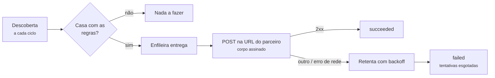

# Webhooks

Em vez de puxar `GET /v1/cases` em laço, um consumidor pode **cadastrar
a URL dele e receber os casos que lhe interessam**.

As regras de uma assinatura são **os mesmos filtros que a listagem já
aceita** — não há gramática de consulta nova para aprender. O que muda é
o sentido: em vez de você perguntar, o serviço avisa.



!!! info "A assinatura pertence à automação do token"
    Como todo o resto do serviço: o claim `azp` do token que cadastrou é
    a automação da assinatura, e não existe campo `automation` no corpo.
    Quem consome duas automações precisa de dois clients OIDC.

---

## Rotas

| Método | Rota | O que faz |
|---|---|---|
| `POST` | `/v1/webhooks` | Cadastra uma assinatura. Devolve o segredo **uma vez**. |
| `GET` | `/v1/webhooks` | Lista as assinaturas da automação do token. |
| `GET` | `/v1/webhooks/{webhook_id}` | Consulta uma assinatura. |
| `PATCH` | `/v1/webhooks/{webhook_id}` | Altera url, regras, `fields`, `enabled`; rotaciona o segredo. |
| `DELETE` | `/v1/webhooks/{webhook_id}` | Remove a assinatura — e com ela o log de entregas. |
| `GET` | `/v1/webhooks/{webhook_id}/deliveries` | Log de entregas: por que não chegou. |
| `POST` | `/v1/webhooks/{webhook_id}/deliveries/{delivery_id}/retry` | Reenfileira uma entrega que falhou. |

Todas exigem `Authorization: Bearer <JWT>`, como as rotas de caso.

As duas listagens (`/v1/webhooks` e o log de entregas) respondem no mesmo
formato paginado de `GET /v1/cases` — `total`, `page`, `page_size`,
`total_pages` e `items` —, com `page_size` até 500 e default 50.

!!! note "`total_pages` ainda não saiu numa release"
    Ele está em `main` e no `openapi.yaml` publicado, mas é posterior ao
    corte da **0.4.2**. Campo aditivo: quem já trata a resposta continua
    funcionando com ou sem ele. Ver
    [Endpoints](endpoints.md#get-listar-e-contar).

---

## Cadastrar

```bash
curl -sX POST https://casehub.interno/v1/webhooks \
  -H "Authorization: Bearer $TOKEN" -H 'Content-Type: application/json' \
  -d '{
        "url": "https://parceiro.exemplo/casehub",
        "environment": "prod",
        "status": "concluido",
        "source_filters": {"referencia": "REF-12345"},
        "fields": ["referencia", "origem.id"]
      }'
```

**Corpo**

| Campo | Tipo | Default | O que faz |
|---|---|---|---|
| `url` | string | — | Destino. `http` ou `https` absoluta. **Obrigatório.** |
| `environment` | enum | todos | Regra: só casos desse ambiente. |
| `status` | enum | todos | Regra: só casos nesse status. |
| `batch_ref` | string | todos | Regra. |
| `source_schema` | string | todos | Regra. |
| `source_filters` | objeto | `{}` | Igualdades sobre `source_record` — o mesmo que `filter=chave=valor`. |
| `source_conditions` | lista | `[]` | `exists`, `not_exists`, `eq`, `ne` sobre `source_record`. |
| `events` | lista | todos | `case.created`, `case.updated`. |
| `fields` | lista | tudo | Caminhos do `source_record` a entregar. Máximo 100. |
| `include_source` | bool | `true` | `false` entrega o caso sem `source_record` nenhum. |
| `cursor_field` | enum | `updated` | `updated` ou `created` — qual carimbo a descoberta acompanha. |
| `enabled` | bool | `true` | Começar pausada é possível. |

Toda regra omitida significa **todos**: uma assinatura sem regra nenhuma
recebe tudo o que a automação produzir. Quem quer dois status cadastra
dois webhooks — o mesmo que faria com dois `GET`.

!!! danger "O `secret` da resposta é a única vez que ele trafega"
    Guarde-o na hora. Nenhum `GET` devolve segredo, e não há como
    consultá-lo depois: perdido, o caminho é **rotacionar**
    (`PATCH` com `rotate_secret: true`), que gera um novo, devolve-o
    naquela resposta e invalida o antigo no mesmo instante.

---

## Entregar só quando o caso estiver pronto

O caso costuma nascer incompleto: a automação cria e enriquece depois.
Entregar na criação manda o registro cru para o sistema do parceiro — e,
do ponto de vista dele, a entrega é definitiva.

Duas regras resolvem isso, e são **eixos diferentes**:

| Campo | Pergunta | Exemplo |
|---|---|---|
| `events` | **quando** o caso mudou | `["case.updated"]` |
| `source_conditions` | **o que** o caso contém | `[{"path": "enriquecimento", "op": "exists"}]` |

```json
{
  "url": "https://parceiro.exemplo/casehub",
  "cursor_field": "updated",
  "events": ["case.updated"],
  "source_conditions": [
    {"path": "enriquecimento.confirmado", "op": "exists"}
  ]
}
```

`events` vazio aceita todos os tipos. `["case.updated"]` é o que exclui a
entrega da criação **sem** excluir as alterações seguintes.

!!! tip "As duas juntas dizem a intenção por escrito"
    `events` sozinho deixa passar um `PATCH` de status num caso que
    ninguém enriqueceu. `source_conditions` sozinho deixa passar a
    criação de um caso que já nasça com a chave. Cadastre as duas.

**Operadores de `source_conditions`** — os mesmos da listagem:

| `op` | Pergunta | `value` |
|---|---|---|
| `exists` | a chave existe (mesmo com valor `null`, objeto ou lista) | recusado |
| `not_exists` | a chave não existe | recusado |
| `eq` | o valor é igual | obrigatório |
| `ne` | o valor existe e difere | obrigatório |

`value` é comparado como escalar. Objeto, lista e `null` são recusados no
cadastro com 400 — eles nunca casariam, e a assinatura ficaria muda.

Vazio não restringe, e as condições **somam** com `source_filters`: as
duas contam para o mesmo teto (`CASEHUB_MAX_SOURCE_FILTERS`, default 20).

!!! danger "Regra que depende de conteúdo exige `cursor_field: updated`"
    Com `created`, um caso que não casava com a regra no instante em que
    nasceu **nunca mais** é reavaliado — `created_at` não se move, e
    assim que a descoberta passa por ele, passou de vez.

    Se o que decide a entrega é algo que a automação grava *depois* de
    criar o caso, use `updated`. Com `created` a assinatura fica muda,
    sem erro em lugar nenhum. O serviço avisa no log ao aceitar esse
    cadastro, mas não o recusa.

!!! warning "A regra é reavaliada na hora de entregar"
    Se você apertar a regra com um `PATCH`, o que já estava na fila e
    deixou de casar termina em `abandoned`, com o motivo no log de
    entregas — não sai para a sua URL. Isso vale para todas as regras da
    assinatura, o tipo de evento inclusive, e **não conta como falha**.

---

## Escolher os campos do `source_record`

`fields` é uma lista de caminhos pontilhados — a mesma gramática do
`filter=origem.id=42`:

| `fields` | O que chega em `source_record` |
|---|---|
| `[]` (ou omitido) | o registro inteiro |
| `["referencia"]` | `{"referencia": "REF-12345"}` |
| `["origem.id"]` | `{"origem": {"id": 42}}` — a estrutura é preservada |
| `["referencia", "nao_existe"]` | só `referencia` — caminho ausente é **omitido**, não vira `null` |

`include_source: false` entrega o caso sem `source_record` nenhum.

!!! tip "É também o controle de privacidade da assinatura"
    O que não está declarado não sai daqui. Numa assinatura de terceiro,
    declarar os caminhos é mais barato que confiar que ninguém vai olhar
    o resto.

---

## O que chega na sua URL

`POST` com `Content-Type: application/json` e estes headers (nomes
case-insensitive, RFC 9110 — busque-os com a API do seu framework, nunca
por chave exata num dicionário):

```
X-Casehub-Event:     case.created | case.updated
X-Casehub-Delivery:  <id da entrega>
X-Casehub-Attempt:   <número da tentativa, a partir de 1>
X-Casehub-Signature: t=<epoch>,v1=<hmac_sha256_hex>
```

**Corpo**

```json
{
  "event": "case.updated",
  "delivered_at": "2026-09-11T12:00:00+00:00",
  "case": {
    "environment": "prod",
    "automation": "minha-automacao",
    "case_id": "a1b2c3",
    "status": "concluido",
    "batch_ref": "lote-a",
    "source_schema": "origem.v1",
    "source_record": {"referencia": "REF-12345"},
    "temporal_workflow_id": null,
    "temporal_run_id": null,
    "started_at": "2026-09-10T09:00:00-03:00",
    "finished_at": null,
    "created_at": "2026-09-10T09:00:02+00:00",
    "updated_at": "2026-09-11T11:59:58+00:00"
  }
}
```

O objeto `case` é serializado pelo **mesmo** modelo que `GET /v1/cases`
devolve: quem consulta e recebe não aprende dois formatos do mesmo
objeto. `source_record` é o único ponto de diferença — o que sai é o
recorte de `fields`, ou nada com `include_source: false`.

O tipo do evento é **derivado dos carimbos do caso**: `case.created`
enquanto `created_at == updated_at`, `case.updated` depois disso.

---

## Verificar a assinatura

O HMAC-SHA256 é sobre `<t>.<corpo bruto>` — o instante é assinado
**junto**, não só transportado ao lado, para que você possa recusar
replay:

```python
import hashlib
import hmac
import time


def confere(secret: str, header: str, corpo: bytes, tolerancia=300) -> bool:
    partes = dict(p.split('=', 1) for p in header.split(',') if '=' in p)
    if abs(time.time() - int(partes['t'])) > tolerancia:
        return False  # fora da janela: replay
    esperado = hmac.new(
        secret.encode(),
        f'{partes["t"]}.'.encode() + corpo,  # o corpo CRU, não reserializado
        hashlib.sha256,
    ).hexdigest()
    return hmac.compare_digest(esperado, partes['v1'])
```

!!! danger "Use o corpo cru da requisição"
    Reserializar o JSON antes de conferir muda os bytes — espaços, ordem
    de chaves — e a assinatura não bate. É o erro mais comum deste tipo
    de integração, e ele aparece como "assinatura inválida" num payload
    perfeitamente legítimo.

O `v1=` no header existe para que uma troca futura de algoritmo possa
acrescentar `v2=` no mesmo header sem quebrar quem só sabe ler `v1`.

---

## O que esperar

**Chega o estado atual do caso, não cada transição.** Duas mudanças entre
dois ciclos chegam fundidas, com o valor final. Se você precisa reagir a
um estado intermediário, o webhook não é o caminho.

**At-least-once, sem ordem garantida.** Um retry pode reentregar. Trate
por `case_id` + `updated_at` e a repetição sai de graça.

**Depende de quem publica usar `on_conflict=skip`.** No modo `update` a
recaptura reescreve tudo e carimba `updated_at` — e você receberia a base
inteira a cada ciclo. Se só lhe interessa caso novo, cadastre
`cursor_field: "created"`: `created_at` nunca muda, então a assinatura
não re-dispara. Ver [Endpoints](endpoints.md#post-upsert-em-lote).

**A latência mínima é o intervalo do ciclo** (`CASEHUB_WEBHOOK_POLL_INTERVAL_SECONDS`,
default 30s) mais a janela de segurança — o mesmo mecanismo do cursor
incremental, que existe para não perder caso.

---

## Quando falha

Entrega que não devolve 2xx é retentada com backoff — **30s, 2min,
10min, 1h, 6h** — e depois marcada como falha definitiva. Consulte o
motivo você mesmo:

```bash
curl -s -H "Authorization: Bearer $TOKEN" \
  'https://casehub.interno/v1/webhooks/<id>/deliveries?status=failed'
```

| `status` da entrega | Significa |
|---|---|
| `pending` | enfileirada, ainda há tentativa pela frente |
| `succeeded` | o seu endpoint devolveu 2xx |
| `failed` | **definitivo**: as tentativas acabaram |
| `abandoned` | não havia o que entregar — a regra deixou de casar, ou o caso foi expurgado pela retenção |

Cada linha traz `attempt`, `http_status`, `error`, `next_attempt_at` e o
`case_updated_at` que a originou. O **corpo enviado não é guardado** — ele
é remontado do estado atual do caso a cada tentativa.

!!! warning "Falhas definitivas seguidas desativam a assinatura"
    Acima de `CASEHUB_WEBHOOK_MAX_CONSECUTIVE_FAILURES` (default 20), o
    serviço desliga a assinatura sozinho e escreve o motivo em
    `disabled_reason`. Para voltar:

    ```bash
    curl -sX PATCH https://casehub.interno/v1/webhooks/<id> \
      -H "Authorization: Bearer $TOKEN" -H 'Content-Type: application/json' \
      -d '{"enabled": true}'
    ```

    Mandar `enabled: true` **zera** `failure_count` e limpa
    `disabled_reason` — senão a assinatura voltaria já perto do teto e
    cairia de novo na primeira falha. Só o valor **enviado** conta: um
    `PATCH` que omite o campo numa assinatura já ativa não apaga o
    histórico de falhas.

### `enabled: false` pausa, não descarta

A pausa cobre os dois lados. O que já estava enfileirado fica parado, sem
consumir tentativa, e volta a sair quando você reativar. O período em que
a descoberta ficou parada **também não se perde**: o cursor da assinatura
congela junto — a descoberta só visita as ativas —, então reativar relê
desde o ponto em que parou.

!!! tip "Espere uma rajada, não um buraco"
    Tudo que mudou durante a pausa entra na fila de uma vez, drenado ao
    longo dos ciclos seguintes. Uma pausa longa numa automação
    movimentada reativa-se melhor fora do horário de pico do seu
    endpoint.

O cursor incremental (`GET /v1/cases?updated_since=`) continua sendo a
recuperação para o que a reativação **não** alcança: o log de entregas
tem prazo (`CASEHUB_WEBHOOK_DELIVERY_RETENTION_DAYS`, default 30 dias), e
repovoar a sua própria base depois de perdê-la nunca passou pelo webhook.

---

## Reenviar uma entrega (redrive)

Uma entrega em `failed` ou `abandoned` volta a ser tentada:

```bash
curl -sX POST \
  https://casehub.interno/v1/webhooks/<id>/deliveries/<delivery_id>/retry \
  -H "Authorization: Bearer $TOKEN"
```

Ela volta com a **contagem de tentativas zerada** — é um redrive manual,
não a continuação da sequência que falhou.

| Estado atual | Resposta |
|---|---|
| `failed` ou `abandoned` | `200`, reenfileirada |
| `pending` | `409` — continua enfileirada |
| `succeeded` | `409` — já chegou até você |

Os dois `409` existem para que um redrive por engano não vire duplicata.

!!! note "O corpo é remontado do estado atual do caso"
    Não do que se tentou enviar antes: o payload nunca é guardado. Se o
    caso mudou nesse meio tempo, você recebe o valor de agora — que é a
    semântica de sincronização de estado deste webhook.

Não há redrive em massa nem automático. Para recuperação de longo prazo,
o caminho continua sendo o cursor.

---

## Operação

O despachante roda **dentro do processo da API**, pelo mesmo scheduler
in-process do expurgo — não há worker separado, e nenhuma dependência
nova entrou no serviço por causa dele.

| Variável | Default | Para quê |
|---|---|---|
| `CASEHUB_WEBHOOK_ENABLED` | `true` | Liga o despachante. |
| `CASEHUB_WEBHOOK_POLL_INTERVAL_SECONDS` | `30` | Intervalo do ciclo de descoberta. |
| `CASEHUB_WEBHOOK_SAFETY_WINDOW_SECONDS` | `30` | Janela relida para trás, para não perder caso. |
| `CASEHUB_WEBHOOK_TIMEOUT_SECONDS` | `10` | Timeout do `POST` ao endpoint do parceiro. |
| `CASEHUB_WEBHOOK_MAX_ATTEMPTS` | `6` | Tentativas antes de `failed`. |
| `CASEHUB_WEBHOOK_MAX_CONSECUTIVE_FAILURES` | `20` | Falhas seguidas que desativam a assinatura. |
| `CASEHUB_WEBHOOK_DELIVERY_RETENTION_DAYS` | `30` | Prazo do log de entregas. |
| `CASEHUB_WEBHOOK_DISCOVERY_PAGE_SIZE` | `200` | Página da varredura. |
| `CASEHUB_WEBHOOK_DELIVERY_BATCH_SIZE` | `50` | Entregas por ciclo. |

Para uma passada avulsa — depois de reativar uma assinatura, por exemplo
— sem esperar o próximo ciclo:

```bash
casehub-webhook
```

!!! warning "A URL cadastrada não é restringida a faixas públicas"
    Qualquer URL alcançável pelo processo é cadastrável, endereços de
    rede interna inclusive, e `https` não é exigido — num endpoint
    `http://`, o corpo e a assinatura trafegam em claro. O que o cadastro
    recusa é só o que não seria buscável: esquema fora de `http`/`https`,
    ou URL sem host.

    Quem abre o cadastro a terceiros de fora da rede precisa tratar isso
    na borda, antes de expor a rota.

---

## O SDK não cobre webhooks

`casehub` cobre as rotas de caso. As rotas de `/v1/webhooks` se chamam
por HTTP direto, com o mesmo `Bearer` que o SDK obtém — nada impede usar
o token do SDK e um `httpx` ao lado.

!!! tip "Cadastrar é uma operação de configuração, não de fluxo"
    Uma assinatura é cadastrada uma vez e vive por conta própria. É por
    isso que ela não sentiu falta de um método de biblioteca: quem
    integra publica casos em laço, mas cadastra webhook uma vez.
