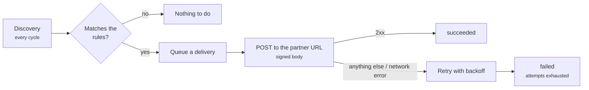

# Webhooks

Instead of polling `GET /v1/cases` in a loop, a consumer can **register
its own URL and receive the cases it cares about**.

A subscription's rules are **the same filters the listing already
accepts** — there is no new query grammar to learn. What changes is the
direction: instead of you asking, the service tells you.



!!! info "A subscription belongs to the token's automation"
    Like everything else in the service: the `azp` claim of the token
    that registered it is the subscription's automation, and there is no
    `automation` field in the body. Consuming two automations takes two
    OIDC clients.

---

## Routes

| Method | Route | What it does |
|---|---|---|
| `POST` | `/v1/webhooks` | Registers a subscription. Returns the secret **once**. |
| `GET` | `/v1/webhooks` | Lists the subscriptions of the token's automation. |
| `GET` | `/v1/webhooks/{webhook_id}` | Reads one subscription. |
| `PATCH` | `/v1/webhooks/{webhook_id}` | Changes url, rules, `fields`, `enabled`; rotates the secret. |
| `DELETE` | `/v1/webhooks/{webhook_id}` | Removes the subscription — and the delivery log with it. |
| `GET` | `/v1/webhooks/{webhook_id}/deliveries` | Delivery log: why it did not arrive. |
| `POST` | `/v1/webhooks/{webhook_id}/deliveries/{delivery_id}/retry` | Re-queues a failed delivery. |

All of them require `Authorization: Bearer <JWT>`, like the case routes.

Both listings (`/v1/webhooks` and the delivery log) answer in the same
paginated shape as `GET /v1/cases` — `total`, `page`, `page_size`,
`total_pages` and `items` — with `page_size` up to 500 and a default of
50.

!!! note "`total_pages` has not shipped in a release yet"
    It is on `main` and in the published `openapi.yaml`, but it came
    after the **0.4.2** cut. The field is additive: a client that already
    handles the response keeps working with or without it. See
    [Endpoints](endpoints.md#get-list-and-count).

---

## Registering

```bash
curl -sX POST https://casehub.internal/v1/webhooks \
  -H "Authorization: Bearer $TOKEN" -H 'Content-Type: application/json' \
  -d '{
        "url": "https://partner.example/casehub",
        "environment": "prod",
        "status": "concluido",
        "source_filters": {"referencia": "REF-12345"},
        "fields": ["referencia", "origem.id"]
      }'
```

**Body**

| Field | Type | Default | What it does |
|---|---|---|---|
| `url` | string | — | Destination. Absolute `http` or `https`. **Required.** |
| `environment` | enum | all | Rule: only cases in that environment. |
| `status` | enum | all | Rule: only cases in that status. |
| `batch_ref` | string | all | Rule. |
| `source_schema` | string | all | Rule. |
| `source_filters` | object | `{}` | Equalities over `source_record` — the same as `filter=key=value`. |
| `source_conditions` | list | `[]` | `exists`, `not_exists`, `eq`, `ne` over `source_record`. |
| `events` | list | all | `case.created`, `case.updated`. |
| `fields` | list | everything | Paths of `source_record` to deliver. Up to 100. |
| `include_source` | bool | `true` | `false` delivers the case with no `source_record` at all. |
| `cursor_field` | enum | `updated` | `updated` or `created` — which stamp discovery follows. |
| `enabled` | bool | `true` | Starting paused is possible. |

Every omitted rule means **all**: a subscription with no rules receives
everything its automation produces. Wanting two statuses means
registering two webhooks — the same you would do with two `GET`s.

!!! danger "The `secret` in the response is the only time it travels"
    Store it right away. No `GET` returns a secret, and there is no way
    to read it later: if it is lost, the path is to **rotate** it
    (`PATCH` with `rotate_secret: true`), which generates a new one,
    returns it in that response and invalidates the old one at the same
    instant.

---

## Deliver only once the case is ready

A case is usually born incomplete: the automation creates it and enriches
it later. Delivering on creation sends the raw record to the partner's
system — and from their point of view, a delivery is final.

Two rules solve this, and they are **different axes**:

| Field | Question | Example |
|---|---|---|
| `events` | **when** the case changed | `["case.updated"]` |
| `source_conditions` | **what** the case contains | `[{"path": "enriquecimento", "op": "exists"}]` |

```json
{
  "url": "https://partner.example/casehub",
  "cursor_field": "updated",
  "events": ["case.updated"],
  "source_conditions": [
    {"path": "enriquecimento.confirmado", "op": "exists"}
  ]
}
```

An empty `events` accepts every type. `["case.updated"]` is what excludes
the creation delivery **without** excluding the changes that follow.

!!! tip "Together they put the intent in writing"
    `events` alone lets a status `PATCH` through on a case nobody
    enriched. `source_conditions` alone lets through the creation of a
    case that is born with the key already set. Register both.

**`source_conditions` operators** — the same as in the listing:

| `op` | Question | `value` |
|---|---|---|
| `exists` | the key exists (even when the value is `null`, an object or a list) | rejected |
| `not_exists` | the key does not exist | rejected |
| `eq` | the value is equal | required |
| `ne` | the value exists and differs | required |

`value` is compared as a scalar. Objects, lists and `null` are rejected
at registration with a 400 — they would never match, and the subscription
would go silent.

An empty list does not restrict, and conditions **add up** with
`source_filters`: both count towards the same cap
(`CASEHUB_MAX_SOURCE_FILTERS`, default 20).

!!! danger "A content rule requires `cursor_field: updated`"
    With `created`, a case that did not match the rule at the instant it
    was born is **never** re-evaluated — `created_at` does not move, and
    once discovery has walked past it, it is past for good.

    If what decides the delivery is something the automation writes
    *after* creating the case, use `updated`. With `created` the
    subscription goes silent, with no error anywhere. The service warns
    in the log when accepting such a registration, but does not reject
    it.

!!! warning "The rule is re-evaluated at delivery time"
    If you tighten a rule with a `PATCH`, whatever was already queued and
    stopped matching ends up `abandoned`, with the reason in the delivery
    log — it does not go out to your URL. This covers every rule of the
    subscription, the event type included, and it does **not** count as a
    failure.

---

## Choosing the `source_record` fields

`fields` is a list of dotted paths — the same grammar as
`filter=origem.id=42`:

| `fields` | What arrives in `source_record` |
|---|---|
| `[]` (or omitted) | the whole record |
| `["referencia"]` | `{"referencia": "REF-12345"}` |
| `["origem.id"]` | `{"origem": {"id": 42}}` — the structure is preserved |
| `["referencia", "does_not_exist"]` | only `referencia` — a missing path is **omitted**, never turned into `null` |

`include_source: false` delivers the case with no `source_record` at all.

!!! tip "It is also the subscription's privacy control"
    What is not declared does not leave here. On a third-party
    subscription, declaring the paths is cheaper than trusting that
    nobody will look at the rest.

---

## What arrives at your URL

A `POST` with `Content-Type: application/json` and these headers (names
are case-insensitive, RFC 9110 — look them up through your framework's
API, never as an exact dictionary key):

```
X-Casehub-Event:     case.created | case.updated
X-Casehub-Delivery:  <delivery id>
X-Casehub-Attempt:   <attempt number, starting at 1>
X-Casehub-Signature: t=<epoch>,v1=<hmac_sha256_hex>
```

**Body**

```json
{
  "event": "case.updated",
  "delivered_at": "2026-09-11T12:00:00+00:00",
  "case": {
    "environment": "prod",
    "automation": "minha-automacao",
    "case_id": "a1b2c3",
    "status": "concluido",
    "batch_ref": "lote-a",
    "source_schema": "origem.v1",
    "source_record": {"referencia": "REF-12345"},
    "temporal_workflow_id": null,
    "temporal_run_id": null,
    "started_at": "2026-09-10T09:00:00-03:00",
    "finished_at": null,
    "created_at": "2026-09-10T09:00:02+00:00",
    "updated_at": "2026-09-11T11:59:58+00:00"
  }
}
```

The `case` object is serialised by the **same** model `GET /v1/cases`
returns: whoever both queries and receives does not learn two formats for
the same object. `source_record` is the only difference — what goes out
is the `fields` projection, or nothing with `include_source: false`.

The event type is **derived from the case stamps**: `case.created` while
`created_at == updated_at`, `case.updated` after that.

---

## Verifying the signature

The HMAC-SHA256 is over `<t>.<raw body>` — the instant is signed
**together with** the body, not merely carried beside it, so that you can
reject replays:

```python
import hashlib
import hmac
import time


def verify(secret: str, header: str, body: bytes, tolerance=300) -> bool:
    parts = dict(p.split('=', 1) for p in header.split(',') if '=' in p)
    if abs(time.time() - int(parts['t'])) > tolerance:
        return False  # outside the window: replay
    expected = hmac.new(
        secret.encode(),
        f'{parts["t"]}.'.encode() + body,  # the RAW body, not re-serialised
        hashlib.sha256,
    ).hexdigest()
    return hmac.compare_digest(expected, parts['v1'])
```

!!! danger "Use the raw request body"
    Re-serialising the JSON before verifying changes the bytes —
    whitespace, key order — and the signature no longer matches. It is
    the most common mistake in this kind of integration, and it shows up
    as "invalid signature" on a perfectly legitimate payload.

The `v1=` in the header exists so that a future algorithm change can add
`v2=` to the same header without breaking anyone who only reads `v1`.

---

## What to expect

**You receive the current state of the case, not every transition.** Two
changes between two cycles arrive merged, with the final value. If you
need to react to an intermediate state, the webhook is not the way.

**At-least-once, with no ordering guarantee.** A retry may re-deliver.
Handle by `case_id` + `updated_at` and the repetition costs you nothing.

**It depends on the publisher using `on_conflict=skip`.** In `update`
mode a re-capture rewrites everything and stamps `updated_at` — and you
would receive the whole base every cycle. If only new cases matter to
you, register `cursor_field: "created"`: `created_at` never changes, so
the subscription never re-fires. See
[Endpoints](endpoints.md#post-batch-upsert).

**The minimum latency is the cycle interval**
(`CASEHUB_WEBHOOK_POLL_INTERVAL_SECONDS`, default 30s) plus the safety
window — the same mechanism as the incremental cursor, which exists so
no case is lost.

---

## When it fails

A delivery that does not return 2xx is retried with backoff — **30s,
2min, 10min, 1h, 6h** — and then marked as a definitive failure. Look up
the reason yourself:

```bash
curl -s -H "Authorization: Bearer $TOKEN" \
  'https://casehub.internal/v1/webhooks/<id>/deliveries?status=failed'
```

| Delivery `status` | Means |
|---|---|
| `pending` | queued, there are still attempts ahead |
| `succeeded` | your endpoint returned 2xx |
| `failed` | **definitive**: attempts are exhausted |
| `abandoned` | there was nothing to deliver — the rule stopped matching, or retention purged the case |

Each row carries `attempt`, `http_status`, `error`, `next_attempt_at` and
the `case_updated_at` that originated it. The **body sent is not stored**
— it is rebuilt from the current state of the case on every attempt.

!!! warning "Consecutive definitive failures disable the subscription"
    Above `CASEHUB_WEBHOOK_MAX_CONSECUTIVE_FAILURES` (default 20) the
    service disables the subscription on its own and writes the reason
    into `disabled_reason`. To bring it back:

    ```bash
    curl -sX PATCH https://casehub.internal/v1/webhooks/<id> \
      -H "Authorization: Bearer $TOKEN" -H 'Content-Type: application/json' \
      -d '{"enabled": true}'
    ```

    Sending `enabled: true` **resets** `failure_count` and clears
    `disabled_reason` — otherwise the subscription would come back
    already near the ceiling and fall over on the first failure. Only
    the value actually **sent** counts: a `PATCH` that omits the field
    on an already-active subscription does not erase the failure
    history.

### `enabled: false` pauses, it does not discard

The pause covers both sides. Whatever was already queued stays put,
without consuming an attempt, and goes out again when you re-enable it.
The period during which discovery was stopped **is not lost either**: the
subscription's cursor freezes with it — discovery only visits active
subscriptions — so re-enabling re-reads from where it stopped.

!!! tip "Expect a burst, not a gap"
    Everything that changed during the pause enters the queue at once,
    drained over the following cycles. A long pause on a busy automation
    re-enables better outside your endpoint's peak hours.

The incremental cursor (`GET /v1/cases?updated_since=`) remains the
recovery path for what re-enabling does **not** reach: the delivery log
has a deadline (`CASEHUB_WEBHOOK_DELIVERY_RETENTION_DAYS`, default 30
days), and repopulating your own base after losing it never went through
the webhook.

---

## Re-sending a delivery (redrive)

A delivery in `failed` or `abandoned` can be tried again:

```bash
curl -sX POST \
  https://casehub.internal/v1/webhooks/<id>/deliveries/<delivery_id>/retry \
  -H "Authorization: Bearer $TOKEN"
```

It comes back with the **attempt count reset** — this is a manual
redrive, not the continuation of the sequence that failed.

| Current state | Response |
|---|---|
| `failed` or `abandoned` | `200`, re-queued |
| `pending` | `409` — still queued |
| `succeeded` | `409` — it already reached you |

Both `409`s exist so that an accidental redrive does not become a
duplicate.

!!! note "The body is rebuilt from the current state of the case"
    Not from what was attempted before: the payload is never stored. If
    the case changed in the meantime, you receive today's value — which
    is the state-synchronisation semantics of this webhook.

There is no bulk or automatic redrive. For long-term recovery, the path
is still the cursor.

---

## Operations

The dispatcher runs **inside the API process**, on the same in-process
scheduler as the purge job — there is no separate worker, and no new
dependency entered the service because of it.

| Variable | Default | What for |
|---|---|---|
| `CASEHUB_WEBHOOK_ENABLED` | `true` | Turns the dispatcher on. |
| `CASEHUB_WEBHOOK_POLL_INTERVAL_SECONDS` | `30` | Discovery cycle interval. |
| `CASEHUB_WEBHOOK_SAFETY_WINDOW_SECONDS` | `30` | Window re-read backwards, so no case is lost. |
| `CASEHUB_WEBHOOK_TIMEOUT_SECONDS` | `10` | Timeout of the `POST` to the partner endpoint. |
| `CASEHUB_WEBHOOK_MAX_ATTEMPTS` | `6` | Attempts before `failed`. |
| `CASEHUB_WEBHOOK_MAX_CONSECUTIVE_FAILURES` | `20` | Consecutive failures that disable the subscription. |
| `CASEHUB_WEBHOOK_DELIVERY_RETENTION_DAYS` | `30` | Delivery log deadline. |
| `CASEHUB_WEBHOOK_DISCOVERY_PAGE_SIZE` | `200` | Discovery page size. |
| `CASEHUB_WEBHOOK_DELIVERY_BATCH_SIZE` | `50` | Deliveries per cycle. |

For a one-off pass — right after re-enabling a subscription, say —
without waiting for the next cycle:

```bash
casehub-webhook
```

!!! warning "The registered URL is not restricted to public ranges"
    Any URL the process can reach can be registered, internal network
    addresses included, and `https` is not required — on an `http://`
    endpoint the body and the signature travel in the clear. What
    registration rejects is only what would not be fetchable at all: a
    scheme outside `http`/`https`, or a URL with no host.

    Whoever opens registration to third parties outside the network has
    to handle this at the edge, before exposing the route.

---

## The SDK does not cover webhooks

`casehub` covers the case routes. The `/v1/webhooks` routes are called
over plain HTTP, with the same `Bearer` the SDK obtains — nothing stops
you from using the SDK's token and an `httpx` alongside it.

!!! tip "Registering is a configuration operation, not a flow one"
    A subscription is registered once and lives on its own. That is why
    it never missed a library method: whoever integrates publishes cases
    in a loop, but registers a webhook once.
