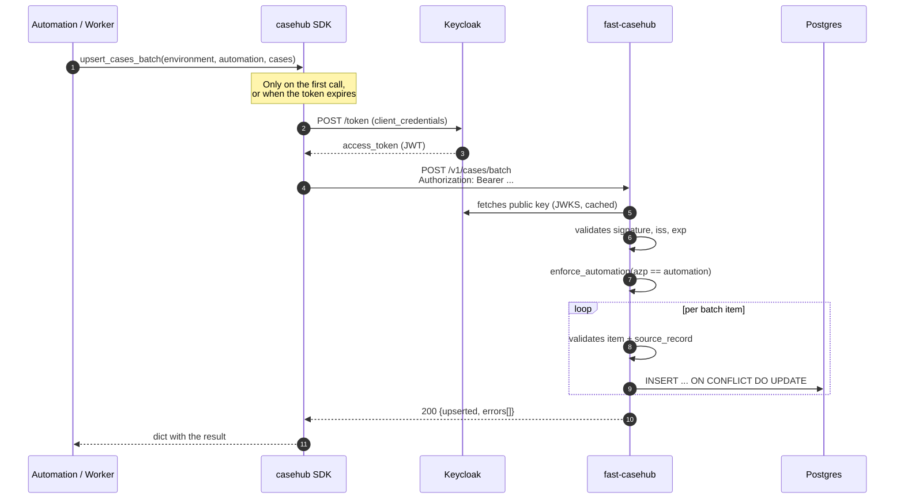
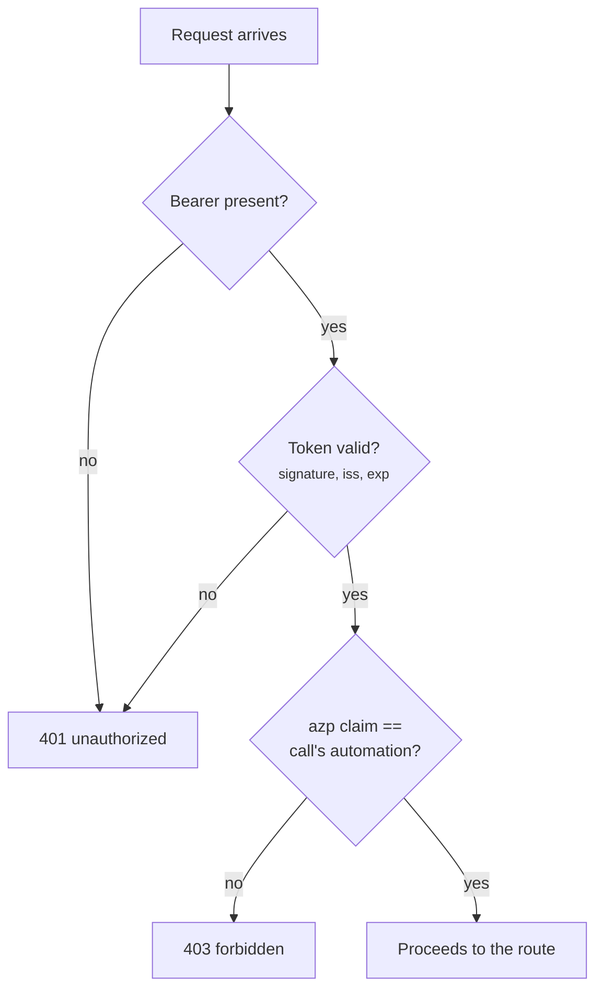
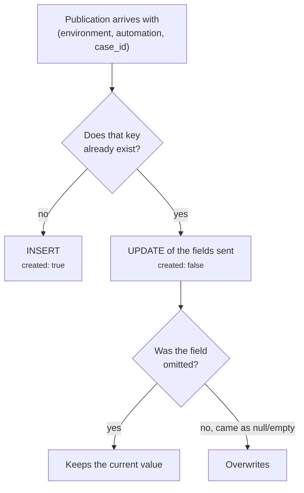
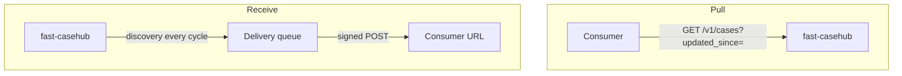
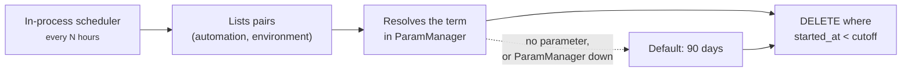
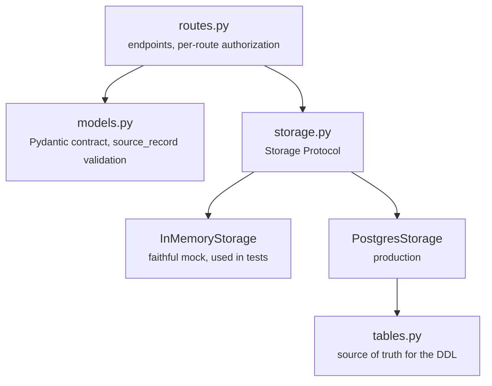

# Architecture

## The path of a case, from source to database

!!! note "A per-item error does not bring the batch down"
    An invalid item lands in `errors[]` with the reason, and the rest are
    stored normally. The status is still 200 — the caller has to **read
    `errors[]`**, not just the HTTP code.

## Authentication and authorization

They are two distinct steps, and conflating them is the source of most of
the confusion.

!!! info "There is no second door"
    There is no alternative credential: without a valid Bearer the
    answer is `401`, and no authentication path skips the automation
    check.

Details in [Authentication](api/autenticacao.md).

## Idempotency: what happens when you republish

This is the rule that confuses integrations the most: **omitting a field is
not the same as sending it empty.** Omitting preserves what was already
stored; sending `source_record: {}` clears the object.

It is what lets an automation republish a case only to update `status`,
without re-sending the whole `source_record` — and what makes a re-capture
preserve the original `started_at`.

## Consuming: pull or receive

There are two paths, and they answer different questions.

| | Cursor (`GET /v1/cases`) | Webhook |
|---|---|---|
| Who starts it | the consumer | the service |
| History recovery | yes, that is what it does | no — the delivery log has a deadline |
| Latency | however often you ask | the dispatcher cycle |
| Needs an exposed endpoint | no | yes |

Both deliver the **current state** of the case, not every transition. The
webhook does not replace the cursor: it removes the polling loop in the
common case, and the cursor remains the recovery path when something is
lost. See [Webhooks](api/webhooks.md).

## Retention

The term is resolved in this order, and the first one that exists wins:

1. `RETENTION_DAYS_<AUTOMATION>_<ENVIRONMENT>`
2. `RETENTION_DAYS_<AUTOMATION>`
3. A default of 90 days

!!! warning "The purge is always scoped by environment"
    Even when only the generic term is configured. Without that scope, a
    short term set up to clean `dev` would wipe the history of `prod` for
    the same automation, silently, on the next cycle.

Details in [Retention](api/retencao.md).

## Service layers

`InMemoryStorage` is not a permissive stub: it implements the same
`Protocol` and is treated as an *executable contract*. The suite runs
against both backends, so a behaviour difference between the mock and
Postgres shows up as a failing test.
