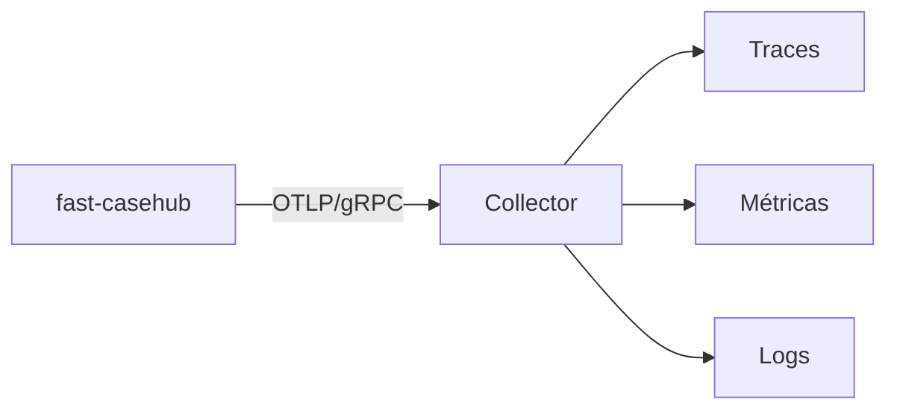

# Observabilidade

Traces, métricas e logs saem por **OTLP/gRPC** para um collector. A
configuração usa as variáveis padrão da especificação do OpenTelemetry,
lidas pelo próprio SDK — não há configuração própria em código.

| Variável | Para quê |
|---|---|
| `OTEL_EXPORTER_OTLP_ENDPOINT` | Endereço do collector. |
| `OTEL_SERVICE_NAME` | Nome do serviço nos traces. |
| `OTEL_RESOURCE_ATTRIBUTES` | Ex.: `deployment.environment=prod`. |
| `OTEL_SDK_DISABLED` | `true` desliga tudo — nenhum exporter é criado. |

`/health` e `/ready` são excluídos da instrumentação: probes de
liveness batem a cada poucos segundos e encheriam os traces de ruído
sem informação.

## Métricas

A instrumentação automática emite as duas primeiras; `casehub.up` e
`casehub.retention.deleted` são as escritas pelo serviço.

| Métrica | Tipo | Labels | O que conta |
|---|---|---|---|
| `http.server.request.duration` | histograma | rota, método, status | Latência por requisição. O `_count` é o que responde "quantas requisições hoje/ontem/semana". |
| `http.server.active_requests` | gauge | rota, método | Requisições em voo. A média responde "quantos clientes ao mesmo tempo". |
| `casehub.up` | gauge | — | Heartbeat: `1` enquanto o processo estiver de pé. |
| `casehub.retention.deleted` | contador | `automation`, `environment` | Casos expurgados por execução do job. |
| `casehub.webhook.delivered` | contador | `automation`, `environment`, `outcome` | **Tentativas** de entrega de webhook, por desfecho. |

!!! warning "O contador é de tentativas, e `outcome` tem quatro valores"
    `succeeded`, `failed`, `retrying` e `abandoned`. Uma entrega que
    falha três vezes e depois chega soma **três** `retrying` e um
    `succeeded` — somar todos os desfechos dá tentativas, não entregas.

    `abandoned` é a entrega que não saiu porque a regra deixou de casar,
    o caso foi expurgado antes, ou a assinatura foi removida no meio da
    fila. Um painel que filtre só sucesso e falha sub-reporta justamente
    o desfecho que mais merece alerta. Ver
    [Webhooks](../api/webhooks.md#quando-falha).

!!! tip "`casehub.up` se lê pela ausência, não pelo valor"
    Ele vale `1` sempre que existe — nunca `0`. O sinal de serviço fora
    do ar é a **falta de dado** na série, não uma queda de valor. Um
    alerta escrito como `casehub.up == 0` nunca dispara; o correto é
    alertar sobre ausência de amostras na janela.

!!! note "As métricas HTTP não contam as probes"
    `/health` e `/ready` estão fora da instrumentação, como dito acima.
    Isso é o que se quer — mas significa que `http.server.request.duration`
    mede o tráfego real, e não bate com o volume que o balanceador vê.

!!! note "O label `environment` foi adicionado"
    Ele entrou quando o expurgo passou a ser escopado por ambiente.
    Consultas que filtram só por `automation` continuam funcionando —
    mas a série passou a ser dividida por ambiente, então um painel que
    mostrava uma linha por automação agora mostra uma por
    automação × ambiente.

## Logs de acesso

As rotas de `/v1/cases*` e `/v1/auth/*` emitem um log `INFO` estruturado
por requisição **bem-sucedida**, com o IP de quem chamou, a identidade
OIDC (claims `sub`/`azp`) e detalhes da operação — em `GET /v1/cases`,
por exemplo, quantos itens bateram o filtro e quantos vieram na página.

Antes, nenhuma rota de negócio logava nada em sucesso: só traces e
métricas respondiam "quem/quando/quantas", e quem olhasse apenas o Loki
não tinha como saber que uma consulta tinha acontecido.

!!! danger "O que esses logs deliberadamente não carregam"
    `source_record` e os **valores** de `filter=` ficam fora. Só as
    chaves usadas no filtro aparecem, nunca o conteúdo — é payload de
    negócio, potencialmente com dado sensível.

    No cadastro de webhook, a URL do parceiro é registrada só como
    esquema e host (`https://hooks.exemplo.com/<redigido>`). Em boa parte
    dos receptores reais — Slack, Teams, Zapier, qualquer callback com
    token no caminho — **a URL inteira é a credencial de publicação**, e
    esse log sai por OTLP. Quem precisar da URL exata tem o `webhook_id`
    na mesma linha e a consulta da assinatura.

## O que não aparece nos traces

!!! danger "`source_record` não é capturado, e isso é proposital"
    A instrumentação HTTP não captura corpo de requisição, e nenhum span
    ou log grava o conteúdo de `source_record`. Como ele pode carregar
    dado sensível, capturá-lo levaria esse dado para o backend de
    observabilidade — um lugar com política de acesso e retenção
    completamente diferentes das do banco.

    A decisão de produto sobre armazenar dado sensível cobre o
    **armazenamento**, não a observabilidade.

!!! warning "`CASEHUB_DB_ECHO=true` quebra isso"
    Ligar o echo do SQLAlchemy faz o SQL — com os parâmetros, incluindo
    o `source_record` — ir para o stdout. É útil em depuração local e
    **não deve ser ligado em ambiente compartilhado**.

Do mesmo modo, a resposta de erro 500 nunca carrega o detalhe da falha:
a exceção vai só para o log correlacionado. Ver
[Erros](../api/erros.md#erro-interno).

## Correlação

Logs saem correlacionados por `trace_id`/`span_id`, então um erro
observado no log leva ao trace completo da requisição.

Para correlacionar com o Temporal, os campos `temporal_workflow_id` e
`temporal_run_id` do caso ligam o registro à execução que o produziu.
São opcionais e não têm chave estrangeira — servem para investigação,
não para integridade referencial.

## O que observar

| Sinal | Por que importa |
|---|---|
| Ausência de `casehub.up` | O processo não está reportando — serviço fora do ar, ou telemetria quebrada. |
| `/ready` respondendo 503 | O banco caiu; o serviço está de pé mas inutilizável. |
| Taxa de 401/403 | Token expirado, client mal provisionado ou automação tentando escopo alheio. |
| `errors[]` não vazio nos lotes | Falha **do lado do publicador** — não aparece como erro HTTP. |
| Aviso de `aud` na subida | A validação de `aud` não está ativa neste ambiente. Ver o roteiro em [Autenticação](../api/autenticacao.md#validacao-de-aud). |
| `casehub.retention.deleted` fora do esperado | Prazo mal configurado, ou ParamManager inacessível fazendo tudo cair no default de 90 dias. |
| `casehub.webhook.delivered{outcome="failed"}` subindo | Endpoint de parceiro fora do ar. Falhas seguidas desativam a assinatura sozinhas — ver [Webhooks](../api/webhooks.md#quando-falha). |

!!! danger "Lote com item recusado não gera erro HTTP"
    É o ponto cego mais comum: o painel de erros 5xx fica limpo enquanto
    casos são descartados. Se você monitora só status HTTP, não está
    monitorando a publicação — instrumente `errors[]` do lado do
    publicador.
