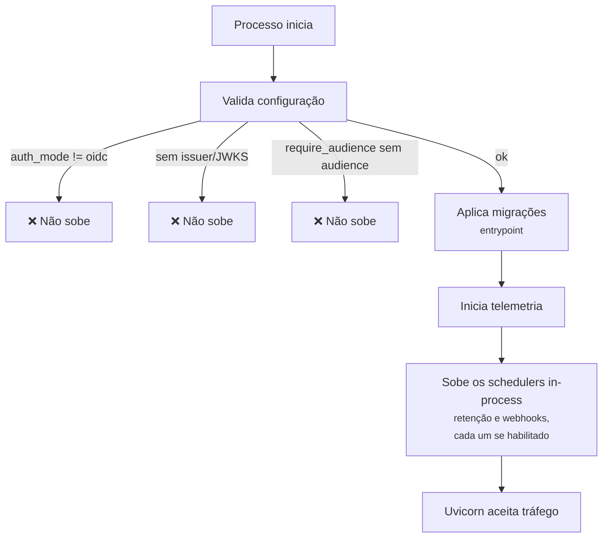

# Deploy

## Como o serviço sobe

!!! tip "Falhar na subida é o comportamento desejado"
    Configuração incompleta derruba o processo em vez de subir num
    estado degradado. É muito mais barato um deploy que não completa do
    que um serviço no ar aceitando requisições que não deveria.

## Perfis do compose

| Profile | O que sobe |
|---|---|
| `uat` | API + Postgres + Keycloak + nginx — stack local completa e descartável. |
| `prod` | A API, o nginx — só HTTPS — e a documentação, apontando para a infraestrutura que já existe. |

Os dois são **mutuamente exclusivos**, e nos dois quem publica a porta no
host é o **nginx**: os serviços de API não publicam porta nenhuma e só
são alcançáveis pela rede do compose. No `uat` o nginx publica
`CASEHUB_PORT` em HTTP; no `prod`, as portas 80 e 443, e só a 443 atende
a API.

!!! warning "O `prod` só atende por HTTPS (desde a API 0.5.0)"
    A porta 80 responde `308` para o `https://`, e o SDK não segue
    redirecionamento: configure o consumidor com `https://` (ver
    [O que mudou](../mudancas.md)). O certificado e a chave são montados no
    proxy a partir de `certs/`, fora do git; sem eles o nginx não sobe. Do
    lado da API nada muda — o `X-Forwarded-Proto` passa a valer `https`
    sozinho.

### Healthcheck

Os serviços de API têm healthcheck em **`/ready`**, não `/health`: é o
que toca o banco, então "processo de pé com o Postgres fora" reprova. O
nginx espera esse `healthy` para subir, e tem healthcheck próprio que ele
mesmo responde sem tocar no upstream — assim "o proxy caiu" e "a API
caiu" continuam sendo dois estados distintos.

!!! note "O healthcheck não reinicia nada"
    `restart: unless-stopped` reage a processo que morre, não a container
    `unhealthy`. O valor aqui é visibilidade (`docker compose ps`) e a
    ordem de subida. Reinício automático por saúde exigiria um
    orquestrador.

docker compose --profile uat up -d

✔ 3 containers running

!!! warning "O `.env` precisa existir antes"
    O compose lê dele via `env_file`. Sem o arquivo, os valores caem em
    defaults de desenvolvimento — inclusive credenciais de banco.

## Build reproduzível

A imagem instala a partir de `requirements.lock`, versionado no
repositório, e só então instala o pacote com `--no-deps`.

!!! note "Por que duas etapas"
    Instalar direto do `pyproject.toml` resolveria as faixas `>=` no
    momento do build — dois builds do mesmo commit produziriam imagens
    diferentes, e uma dependência publicada no meio do caminho entraria
    em produção sem ninguém ter decidido.

Para regerar o lock, sempre em container Linux (que é o alvo da
imagem):

docker run --rm -v "$PWD:/src" -w /src python:3.13-slim \
  sh -c "pip install pip-tools && pip-compile --no-header \
  --strip-extras --output-file=requirements.lock pyproject.toml"

!!! danger "Não regere o lock no Windows"
    Os marcadores de plataforma resolvidos seriam os do Windows, e a
    imagem Linux receberia o conjunto errado de pacotes.

## Migrações

Aplicadas automaticamente pelo entrypoint da imagem, antes de o
processo aceitar tráfego. `tables.py` é a fonte de verdade do DDL:
alterar a tabela lá e então gerar a revisão do Alembic — nunca escrever
a revisão à mão a partir do banco.

## Variáveis por ambiente

| | dev | homolog / prod |
|---|---|---|
| `CASEHUB_STORAGE` | `memory` ou `postgres` | `postgres` |
| `CASEHUB_AUTH_MODE` | `oidc` | `oidc` |
| `CASEHUB_OIDC_*` | do Keycloak local | do Keycloak corporativo |
| `CASEHUB_RETENTION_ENABLED` | `false` | `true` |
| `CASEHUB_WEBHOOK_ENABLED` | `false` | `true` |

!!! danger "Sem issuer e JWKS, o serviço não sobe"
    É deliberado: uma configuração de autenticação pela metade falha no
    arranque, em vez de virar `401` inexplicável depois. Ver
    [Autenticação](../api/autenticacao.md).

## Pipeline

| Estágio | O que roda |
|---|---|
| `lint` | `ruff check` e `ruff format --check`. |
| `test` | Suíte contra mock **e** Postgres real. |
| `build` | Valida que a imagem builda. |
| `security` | `pip-audit` (bloqueante) e `gitleaks` sobre o histórico completo. |

!!! note "Por que o gitleaks precisa de `GIT_DEPTH: 0`"
    O clone raso padrão só enxerga os commits recentes. Um segredo
    introduzido antes disso passaria despercebido — a varredura só vale
    sobre o histórico inteiro.
