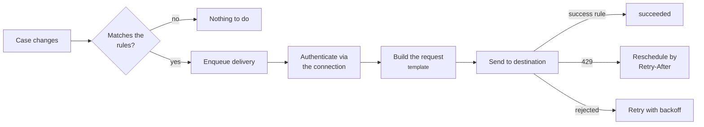

# Delivering to a third-party API

A [webhook](webhooks.en.md) requires the consumer to build a receiver
from scratch. When the other side **already has an API with its own
contract** — verb, path, body and authentication decided by them — a
subscription can deliver in that format, with no receiver to write.

Two pieces, and the split has a reason:

| Piece | What it holds | Why it is separate |
|---|---|---|
| **Delivery connection** | where to deliver and how to authenticate | it is **shared**: one login serves several subscriptions, and rotating the credential is a single operation |
| **Request specification** | what to send, in the shape the destination expects | it is per subscription, because each one projects and maps the case differently |



!!! info "A subscription without a specification is still a webhook"
    Everything on this page is **additive**. A subscription without
    `request_spec` delivers exactly what it always delivered: same
    verb, same body, same `X-Casehub-*` headers and the same HMAC
    signature.

---

## 1. Register the connection

```bash
curl -X POST https://<host>/v1/delivery-connections \
  -H "Authorization: Bearer $TOKEN" \
  -H 'Content-Type: application/json' -d '{
  "name": "crm-production",
  "base_url": "https://api.example.com",
  "auth_mode": "login_token",
  "auth_config": {
    "url": "https://api.example.com/v1/auth/",
    "body_template": {
      "username": {"$concat": [{"$secret": "tenant"}, {"$const": "\\"}, {"$secret": "user"}]},
      "password": {"$secret": "password"}
    },
    "token_path": "token",
    "expires_in_path": "expiresIn",
    "header_format": "Bearer {token}"
  },
  "auth_secrets": {"tenant": "...", "user": "...", "password": "..."},
  "rate_limit_per_second": 8
}'
```

### Authentication modes

| `auth_mode` | When to use it |
|---|---|
| `none` | open destination, or one that authenticates some other way |
| `hmac_casehub` | the classic webhook — the default for every existing subscription |
| `static_headers` | fixed key in a header of your choosing |
| `basic` | user and password in `Authorization: Basic` |
| `bearer` | static token, no renewal |
| `oauth2_client_credentials` | standard OAuth2 issuer |
| `login_token` | the destination has its own login endpoint |

`login_token` is the most general one: it authenticates wherever you
point it, reads the token **by a configurable path** and injects it
into a header whose name and format are also yours.

!!! tip "`token_path` is configurable because the field name varies"
    Some APIs do not even document what the token field is called in
    the login response. Find out with the
    [connection test](#2-check-the-credential): if the path is wrong,
    the response says exactly that.

The login body is built from the registered secrets and supports
composition — `$secret`, `$const` and `$concat`. That is what allows a
composite username without storing everything as a single secret, so
the tenant does not have to be rewritten every time the password
rotates.

### What never leaves

!!! warning "The credential goes in and never comes back"
    No response from this API returns `auth_secrets`, and none returns
    the cached token. If lost, a credential is **rewritten** via
    `PATCH`, not read back. `PATCH` replaces the secrets wholesale,
    with no per-key merge — so no stale secret survives unseen.

### `base_url` requires TLS and an external destination

Stricter than webhook registration, deliberately: a webhook URL
**receives** the case, while a connection may **send a username and
password** to the destination. Private network, loopback and metadata
addresses are rejected at registration.

### Throughput

`rate_limit_per_second` spaces out that connection's requests.

!!! warning "Set it **below** the ceiling the destination publishes"
    The window is counted here, at send time, and there, at arrival
    time. With variable latency the two do not line up, and setting it
    at the exact limit leaves you fighting the boundary — taking a
    `429` now and then with nothing wrong on either side. For a
    destination that cuts at 10/s, use 8.

    The control is per process. It is best effort, not a guarantee.

---

## 2. Check the credential

```bash
curl -X POST https://<host>/v1/delivery-connections/$ID/test \
  -H "Authorization: Bearer $TOKEN"
```

```json
{"ok": true, "auth_mode": "login_token", "error": null, "http_status": null}
```

It authenticates **for real** against the destination, ignoring any
cached token — the question is whether the registered credential works
now, and a cache would answer about the past. No case is delivered.

Do this **before** pointing any subscription at the connection.
Without it, a wrong credential only shows up as a delivery failing in
the background, in a log nobody may read.

---

## 3. Declare the request

The filtering rules are the webhook's. What changes is `request_spec` —
and the central idea is one:

!!! abstract "The shape of the template is the shape of the destination"
    The body you declare **is** the body that goes out. A flat
    key-to-key map would not produce an array of label/value pairs; the
    template does, because it has the shape the destination expects.

```json
{
  "connection_id": "<connection id>",
  "fields": ["document", "name", "external_id"],
  "request_spec": {
    "method": "PUT",
    "path": {"$concat": ["/v1/case/", {"$from": "case.source_record.external_id"}]},
    "body": {
      "fields": [
        {"fieldLabel": {"$const": "Document"},
         "value": {"$from": "case.source_record.document",
                   "$transforms": [{"op": "keep_digits"}]}},
        {"fieldLabel": {"$const": "Full Name"},
         "value": {"$from": "case.source_record.name",
                   "$transforms": [{"op": "trim"}, {"op": "upper"}]}},
        {"fieldLabel": {"$const": "Case Status"},
         "value": {"$from": "case.status",
                   "$transforms": [{"op": "map", "table": {"aberto": "OPEN", "concluido": "CLOSED"}}]}},
        {"fieldLabel": {"$const": "Opened At"},
         "value": {"$from": "case.started_at",
                   "$transforms": [{"op": "date_format", "from": "iso8601", "to": "epoch_ms"}]}},
        {"fieldLabel": {"$const": "Note"},
         "value": {"$from": "case.source_record.note", "$omit_parent": true}}
      ],
      "details": {
        "$each": "case.source_record.extras", "$as": "extra",
        "$template": {"fieldLabel": {"$from": "extra.label"},
                      "value": {"$from": "extra.value", "$transforms": [{"op": "cast", "to": "string"}]}}
      }
    }
  },
  "success_rule": {"status": [200], "body": [{"path": "status", "op": "eq", "value": "OK"}]}
}
```

### Directives

| Directive | What it does |
|---|---|
| `$const` | fixed value, including an object or array |
| `$from` | reads a path from the case and applies the transforms |
| `$concat` | joins parts as text |
| `$format` | positional formatting, `{0}`, `{1}` |
| `$each` | repeats a sub-template over a list in the record |

Paths use the same dotted grammar as the filters, including list
indexes: `case.source_record.extras.0.label`, and a negative index
counts from the end.

### Value transforms

Applied **in the declared order**.

| `op` | Effect |
|---|---|
| `trim`, `upper`, `lower` | whitespace and case |
| `regex_replace`, `regex_extract` | replacement and extraction by regular expression |
| `keep_digits` | keeps digits only |
| `strip_chars` | removes the given characters |
| `substring`, `pad`, `truncate` | slicing, padding and cutting |
| `map` | value dictionary (`aberto` → `OPEN`) |
| `date_format` | between `iso8601`, `epoch_ms`, `epoch_s` and `%` formats |
| `cast` | type conversion |
| `json_encode` | object becomes text |
| `default` | value when missing or empty |

### When the data is not there

| Declaration | What happens |
|---|---|
| nothing | **the key disappears** from the body — it never becomes null |
| `$default` | uses the declared value |
| `$omit_parent` | **the whole object containing the field disappears** |
| `$required` | the delivery ends, with the path in the error, and is not retried |

!!! tip "`$omit_parent` exists for the label/value pair"
    Dropping only the key is right for a nested object and wrong for a
    pair: it would leave `{"fieldLabel": "Note"}` with no value, which
    the destination either rejects or stores empty.

### `fields` is still the privacy control

The template only sees the `source_record` **already projected** by
`fields`. What is not declared there does not leave the service, by any
route.

### `success_rule`

By status range and, optionally, by a predicate over the response —
with the same operators as the content filters. Omitted, 2xx applies.

!!! warning "Some destinations answer `200` with an error in the body"
    Without the rule, that delivery would count as done and the case
    would vanish silently. A response that is not a readable object
    **does not** pass the predicate.

---

## 4. Check before turning it on

```bash
curl -X POST https://<host>/v1/webhooks/$SUB/preview \
  -H "Authorization: Bearer $TOKEN" \
  -H 'Content-Type: application/json' -d '{}'
```

Renders against a real case and returns verb, URL, headers and body —
**without sending anything and without recording a delivery**. Without
`case_id`, it uses the most recent case matching the rules.

Headers come back **redacted**: the authentication one carries the
credential, and returning it here would be a way to read it back.

A path that does not resolve shows up in this response, not as a
destination error in a background log.

---

## What to expect in operation

| Situation | What the service does |
|---|---|
| `429` from the destination | reschedules by `Retry-After` (1 h cap) and **counts no failure** |
| `401`/`403` | re-authenticates **once** and repeats the same attempt |
| destination unreachable, credential rejected | counts a failure on the **connection** |
| destination rejected the content | counts a failure on the **subscription** |
| required field missing | ends the delivery, counting no failure |
| `3xx` | treats it as a wrong URL; **does not follow the redirect** |

!!! danger "Redirects are not followed, and that is deliberate"
    Following a `301`/`302`/`303` would switch the verb to `GET`,
    **drop the body** and resend the authorization header to the
    address pointed at — possibly another host. The result would be an
    empty read answered with `200`, recorded as a successful delivery
    **with nothing having arrived**. Fix the registered URL; the
    address pointed at is in the delivery record.

### A disabled connection pauses, it does not discard

Repeated reachability or credential failures disable the connection.
That **pauses** the deliveries of every subscription using it, without
consuming an attempt. `PATCH enabled=true` brings them all back at once
and resets the counter.

This is deliberate: a changed password is **one** broken thing, and
disabling subscription by subscription would force re-enabling them one
by one.

### Delivery is at-least-once

As with webhooks. Against a `PUT` on a known resource this is harmless;
against a creating `POST` **without an idempotency key, a repeat
duplicates at the destination**. Declare an idempotency header from the
delivery identifier when the destination supports one.

### Diagnostics

The delivery log keeps a status and a short message. A snippet of the
response is only kept when the connection declares `capture_response` —
off by default, because the response may echo what was sent.

Headers and bodies sent **never** reach any log.

---

## Routes

| Method | Route | What it does |
|---|---|---|
| `POST` | `/v1/delivery-connections` | registers a connection |
| `GET` | `/v1/delivery-connections` | lists the automation's connections |
| `GET` | `/v1/delivery-connections/{id}` | reads one |
| `PATCH` | `/v1/delivery-connections/{id}` | changes it, including rotating the credential |
| `DELETE` | `/v1/delivery-connections/{id}` | removes it, if no subscription uses it |
| `POST` | `/v1/delivery-connections/{id}/test` | authenticates for real |
| `POST` | `/v1/webhooks/{id}/preview` | shows what would be sent |

A connection belongs to the automation in the `azp` claim, like
everything else: another automation's id answers `404`, never `403`.
