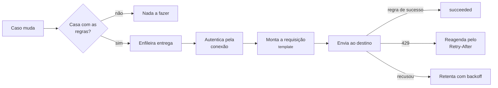

# Entregar para uma API de terceiro

Um [webhook](webhooks.md) exige que o consumidor construa um receptor
sob medida. Quando do outro lado **já existe uma API com contrato
próprio** — verbo, caminho, corpo e autenticação decididos por ela —, a
assinatura pode entregar naquele formato, sem ninguém escrever receptor
nenhum.

São duas peças, e a separação tem motivo:

| Peça | O que guarda | Por que é separada |
|---|---|---|
| **Conexão de destino** | para onde entregar e como autenticar | é **compartilhada**: um login serve várias assinaturas, e rotacionar a credencial é uma operação só |
| **Especificação de requisição** | o que enviar, na forma que o destino espera | é por assinatura, porque cada uma recorta e mapeia o caso de um jeito |



!!! info "Assinatura sem especificação continua sendo webhook"
    Tudo nesta página é **aditivo**. Uma assinatura sem
    `request_spec` entrega exatamente o que sempre entregou: mesmo
    verbo, mesmo corpo, mesmos cabeçalhos `X-Casehub-*` e a mesma
    assinatura HMAC.

---

## 1. Cadastrar a conexão

```bash
curl -X POST https://<host>/v1/delivery-connections \
  -H "Authorization: Bearer $TOKEN" \
  -H 'Content-Type: application/json' -d '{
  "name": "crm-producao",
  "base_url": "https://api.exemplo.com",
  "auth_mode": "login_token",
  "auth_config": {
    "url": "https://api.exemplo.com/v1/auth/",
    "body_template": {
      "username": {"$concat": [{"$secret": "tenant"}, {"$const": "\\"}, {"$secret": "usuario"}]},
      "password": {"$secret": "senha"}
    },
    "token_path": "token",
    "expires_in_path": "expiresIn",
    "header_format": "Bearer {token}"
  },
  "auth_secrets": {"tenant": "...", "usuario": "...", "senha": "..."},
  "rate_limit_per_second": 8
}'
```

### Modos de autenticação

| `auth_mode` | Quando usar |
|---|---|
| `none` | destino aberto, ou que autentica por outro meio |
| `hmac_casehub` | o webhook clássico — é o default de toda assinatura antiga |
| `static_headers` | chave fixa em cabeçalho próprio |
| `basic` | usuário e senha em `Authorization: Basic` |
| `bearer` | token fixo, sem renovação |
| `oauth2_client_credentials` | emissor OAuth2 padrão |
| `login_token` | o destino tem endpoint de login próprio |

`login_token` é o mais genérico: ele autentica onde você mandar, lê o
token **por um caminho configurável** e o injeta num cabeçalho cujo
nome e formato também são seus.

!!! tip "`token_path` é configurável porque o nome do campo varia"
    Há API que sequer publica como se chama o campo do token na
    resposta do login. Descubra com o [teste de conexão](#2-conferir-a-credencial):
    se o caminho estiver errado, a resposta diz exatamente isso.

O corpo do login é montado a partir dos segredos cadastrados, e aceita
composição — `$secret`, `$const` e `$concat`. É o que permite um
usuário em formato composto sem guardar tudo num segredo só, para o
tenant não precisar ser reescrito toda vez que a senha girar.

!!! note "Mesmo motor, dois perfis"
    O login e a requisição da entrega são montados pelo **mesmo**
    motor de template, em perfis diferentes. `$secret` só existe no
    perfil da conexão — declarado dentro de `request_spec`, ele é
    recusado no cadastro. E o caminho inverso vale igual: o login não
    enxerga o caso, então `$from`, `$each`, `$when` e `$alert` não
    existem lá. `$first` existe nos dois.

### O que não sai daqui

!!! warning "A credencial entra e nunca volta"
    Nenhuma resposta desta API devolve `auth_secrets`, e nenhuma
    devolve o token em cache. Perdida, a credencial se **regrava** por
    `PATCH`, não se consulta. O `PATCH` substitui os segredos por
    inteiro, sem mesclar por chave — assim nenhum segredo antigo
    sobrevive sem alguém ver.

### `base_url` exige TLS e destino externo

Mais estrito que o cadastro de webhook, e de propósito: a URL de um
webhook **recebe** o caso, enquanto uma conexão pode **enviar usuário e
senha** ao destino. Endereço de rede privada, laço local ou metadata é
recusado no cadastro.

### Vazão

`rate_limit_per_second` espaça os envios daquela conexão.

!!! warning "Configure **abaixo** do teto que o destino publica"
    A janela é contada aqui, no instante do envio, e lá, no instante em
    que ele recebe. Com latência variável as duas não coincidem, e quem
    configura no limite exato fica disputando a borda — tomando `429`
    de vez em quando sem que nada esteja errado dos dois lados. Para um
    destino que corta em 10/s, use 8.

    O controle é por processo. É melhor esforço, não garantia.

---

## 2. Conferir a credencial

```bash
curl -X POST https://<host>/v1/delivery-connections/$ID/test \
  -H "Authorization: Bearer $TOKEN"
```

```json
{"ok": true, "auth_mode": "login_token", "error": null, "http_status": null}
```

Autentica **de verdade** no destino, ignorando qualquer token em cache
— a pergunta é se a credencial cadastrada funciona agora, e um cache
responderia sobre o passado. Nenhum caso é entregue.

Faça isto **antes** de apontar qualquer assinatura para a conexão. Sem
este passo, credencial errada só se manifesta como entrega falhando em
segundo plano, num registro que talvez ninguém consulte.

---

## 3. Declarar a requisição

As regras de filtro são as mesmas do webhook. O que muda é
`request_spec` — e a ideia central é uma só:

!!! abstract "A forma do template é a forma do destino"
    O corpo que você declara **é** o corpo que sai. Um mapa
    chave→chave plano não produziria um array de pares rótulo-valor; o
    template produz, porque ele tem a forma do que o destino espera.

```json
{
  "connection_id": "<id da conexão>",
  "fields": ["documento", "nome", "id_externo"],
  "request_spec": {
    "method": "PUT",
    "path": {"$concat": ["/v1/case/", {"$from": "case.source_record.id_externo"}]},
    "body": {
      "fields": [
        {"fieldLabel": {"$const": "Document"},
         "value": {"$from": "case.source_record.documento",
                   "$transforms": [{"op": "keep_digits"}]}},
        {"fieldLabel": {"$const": "Full Name"},
         "value": {"$from": "case.source_record.nome",
                   "$transforms": [{"op": "trim"}, {"op": "upper"}]}},
        {"fieldLabel": {"$const": "Case Status"},
         "value": {"$from": "case.status",
                   "$transforms": [{"op": "map", "table": {"aberto": "OPEN", "concluido": "CLOSED"}}]}},
        {"fieldLabel": {"$const": "Opened At"},
         "value": {"$from": "case.started_at",
                   "$transforms": [{"op": "date_format", "from": "iso8601", "to": "epoch_ms"}]}},
        {"fieldLabel": {"$const": "Observacao"},
         "value": {"$from": "case.source_record.observacao", "$omit_parent": true}}
      ],
      "details": {
        "$each": "case.source_record.extras", "$as": "extra",
        "$template": {"fieldLabel": {"$from": "extra.rotulo"},
                      "value": {"$from": "extra.valor", "$transforms": [{"op": "cast", "to": "string"}]}}
      }
    }
  },
  "success_rule": {"status": [200], "body": [{"path": "status", "op": "eq", "value": "OK"}]}
}
```

### Diretivas

| Diretiva | O que faz |
|---|---|
| `$const` | valor fixo, inclusive objeto ou array |
| `$from` | lê um caminho do caso e aplica os tratamentos |
| `$concat` | junta partes como texto |
| `$format` | formatação posicional, `{0}`, `{1}` |
| `$each` | repete um sub-template sobre uma lista do registro |
| `$first` | usa o primeiro candidato que tiver valor |

Os caminhos usam a mesma gramática pontilhada dos filtros, incluindo
índice de lista: `case.source_record.extras.0.rotulo`, e negativo conta
do fim.

### Tratamentos de valor

Aplicados **na ordem declarada**.

| `op` | Efeito |
|---|---|
| `trim`, `upper`, `lower` | recorte de espaços e caixa |
| `regex_replace`, `regex_extract` | substituição e extração por expressão regular |
| `keep_digits` | mantém só os números |
| `strip_chars` | remove os caracteres informados |
| `substring`, `pad`, `truncate` | recorte, preenchimento e corte |
| `map` | dicionário de valores (`aberto` → `OPEN`) |
| `date_format` | entre `iso8601`, `epoch_ms`, `epoch_s` e formatos com `%` |
| `cast` | conversão de tipo |
| `json_encode` | objeto vira texto |
| `default` | valor quando ausente ou vazio |

### Quando o dado não existe

| Declaração | O que acontece |
|---|---|
| nada | **a chave some** do corpo — nunca vira nulo |
| `$default` | usa o valor declarado |
| `$omit_parent` | **o objeto que contém o campo some inteiro** |
| `$required` | a entrega termina, com o caminho no erro, e não é repetida |
| `$null_as_absent` | trata o `null` gravado no registro como ausência |

!!! tip "`$omit_parent` existe para o par rótulo-valor"
    Omitir só a chave está certo para objeto aninhado e errado para um
    par: deixaria `{"fieldLabel": "Observacao"}` sem valor, que o
    destino ou recusa ou grava vazio.

Sem `$null_as_absent`, um `null` gravado é **valor**: ele atravessa os
tratamentos e sai `null` no corpo. Com ele, o campo vira ausente
**antes** dos tratamentos, e aí `$default`, `$omit_parent` e
`$required` passam a valer também para esse caso.

### Escolher o primeiro que tiver valor

`$first` percorre os candidatos **na ordem declarada** e usa o
primeiro que tiver valor. É o que resolve o campo que mora em mais de
um lugar do registro, sem repetir o par rótulo-valor para cada origem.

```json
{"fieldLabel": {"$const": "E-mail"},
 "value": {
   "$first": [
     {"$from": "case.source_record.email"},
     {"$from": "case.source_record.contatos.0.email"},
     {"$when": [{"path": "origem", "op": "eq", "value": "cadastro"}],
      "$then": {"$from": "case.source_record.email_cadastro"}}
   ],
   "$transforms": [{"op": "lower"}],
   "$default": null}}
```

- **"Ter valor" é o mesmo `present` dos filtros**: ausente, nulo,
  vazio e só espaço não contam. Candidato que resolve para `null` já
  entra como sem valor, sem precisar de `$null_as_absent`.
- Um candidato pode vir com guarda: `$when` é uma condição sobre o
  caso, com a mesma gramática dos filtros de conteúdo, e `$then` é o
  candidato que ela libera. As duas chaves **só existem dentro de
  `$first`** — em qualquer outro lugar do template o cadastro é
  recusado.
- Os `$transforms` do `$first` são aplicados **no vencedor**, uma vez.
  Cada candidato pode ter os seus, aplicados antes.
- Sem vencedor, valem `$default`, `$omit_parent` e `$required`, como
  em qualquer outro campo.

### Avisar quando o campo sai vazio

`$alert` marca um campo cujo vazio interessa a quem opera. Ele **não**
muda o que é enviado: a entrega sai igual, com o `$default` declarado.
E ele só dispara quando o campo fica mesmo sem valor: um `$default`
que **preenche** o campo não gera aviso; `"$default": null` gera,
porque `null` é ausência de valor.

```json
{"fieldLabel": {"$const": "E-mail"},
 "value": {"$first": ["..."], "$default": null, "$alert": "E-MAIL"}}
```

O aviso aparece em dois lugares:

- na resposta do `/preview`, em `warnings`, como
  `{"label": "E-MAIL", "count": 1}`;
- no log do serviço, um registro por rótulo e **só na primeira
  tentativa** da entrega — a repetição não multiplica o alerta, e o
  redrive avisa de novo.

Os avisos são agregados por rótulo e carregam **só o rótulo e a
contagem**, nunca o conteúdo do caso. É o que permite ligar um alerta
sobre eles sem levar dado do cliente para o painel.

!!! tip "O aviso acompanha o trecho que sobreviveu"
    Aviso de objeto descartado por `$omit_parent`, ou de candidato que
    perdeu o `$first`, não é emitido: ele sai junto com o trecho que
    não foi para o corpo.

### `fields` continua sendo o controle de privacidade

O template só enxerga o `source_record` **já recortado** por `fields`.
O que não está declarado ali não sai do serviço, por caminho nenhum.

### `success_rule`

Por faixa de status e, opcionalmente, por um predicado sobre a resposta
— com os mesmos operadores dos filtros de conteúdo. Omitida, vale 2xx.

!!! warning "Há destino que responde `200` com erro no corpo"
    Sem a regra, essa entrega contaria como feita e o caso sumiria em
    silêncio. Resposta que não é objeto interpretável **não** passa no
    predicado.

---

## 4. Conferir antes de ligar

```bash
curl -X POST https://<host>/v1/webhooks/$SUB/preview \
  -H "Authorization: Bearer $TOKEN" \
  -H 'Content-Type: application/json' -d '{}'
```

Renderiza contra um caso real e devolve verbo, URL, cabeçalhos e corpo
— **sem enviar nada e sem registrar entrega**. Sem `case_id`, usa o
caso mais recente que casa com as regras.

Os cabeçalhos vêm **redigidos**: o de autenticação carrega credencial,
e devolvê-lo aqui seria um jeito de lê-la de volta.

Um caminho que não resolve aparece nesta resposta, e não como erro do
destino num registro de segundo plano. Os `$alert` que dispararam vêm
em `warnings`, sem gerar registro no log — a pré-visualização não é
uma entrega.

Para ver o mesmo sobre uma página inteira de casos, a listagem aceita
`render_with` — veja [Endpoints](endpoints.md#get-listar-e-contar).

---

## O que esperar em operação

| Situação | O que o serviço faz |
|---|---|
| `429` do destino | reagenda pelo `Retry-After` (teto de 1 h) e **não conta falha** |
| `401`/`403` | reautentica **uma vez** e repete a mesma tentativa |
| destino inalcançável, credencial recusada | conta falha na **conexão** |
| destino recusou o conteúdo | conta falha na **assinatura** |
| campo obrigatório ausente | termina a entrega, sem contar falha |
| `3xx` | trata como URL errada; **não segue o redirecionamento** |

!!! danger "Redirecionamento não é seguido, e isso é proposital"
    Seguir um `301`/`302`/`303` trocaria o verbo para `GET`,
    **descartaria o corpo** e reenviaria o cabeçalho de autorização
    para o endereço apontado — que pode ser outro host. O resultado
    seria uma leitura vazia respondida com `200`, registrada como
    entrega bem-sucedida **sem nada ter chegado**. Corrija a URL
    cadastrada; o endereço apontado vem no registro da entrega.

### Conexão desativada pausa, não descarta

Falhas seguidas de alcance ou credencial desativam a conexão. Isso
**pausa** as entregas de todas as assinaturas que a usam, sem consumir
tentativa. `PATCH enabled=true` religa todas de uma vez e zera o
contador.

Foi assim de propósito: uma senha trocada é **uma** coisa quebrada, e
desativar assinatura por assinatura obrigaria a reativar uma a uma.

### Entrega é at-least-once

Como no webhook. Contra um `PUT` em recurso conhecido isso é
inofensivo; contra um `POST` de criação **sem chave de idempotência, a
repetição duplica no destino**. Declare um cabeçalho de idempotência a
partir do identificador da entrega quando o destino suportar.

### Diagnóstico

O registro de entregas guarda status e mensagem curta. Um trecho da
resposta só é guardado quando a conexão declara `capture_response` —
desligado por padrão, porque a resposta pode ecoar o que foi enviado.

Cabeçalhos e corpo enviados **nunca** vão para registro nenhum.

---

## Rotas

| Método | Rota | O que faz |
|---|---|---|
| `POST` | `/v1/delivery-connections` | cadastra uma conexão |
| `GET` | `/v1/delivery-connections` | lista as conexões da automação |
| `GET` | `/v1/delivery-connections/{id}` | consulta uma |
| `PATCH` | `/v1/delivery-connections/{id}` | altera, inclusive rotacionar credencial |
| `DELETE` | `/v1/delivery-connections/{id}` | remove, se nenhuma assinatura usar |
| `POST` | `/v1/delivery-connections/{id}/test` | autentica de verdade |
| `POST` | `/v1/webhooks/{id}/preview` | mostra o que seria enviado |

A conexão pertence à automação do claim `azp`, como todo o resto: id de
outra automação responde `404`, nunca `403`.
