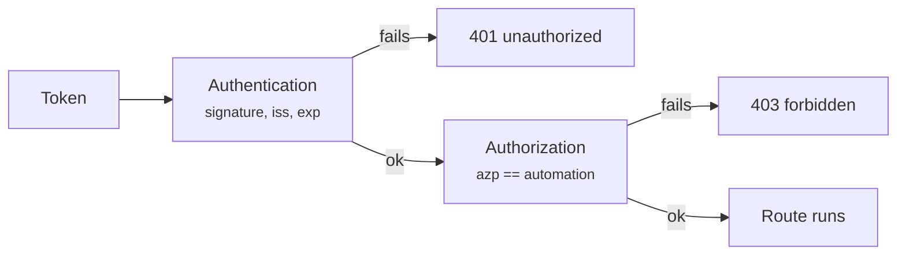

# Authentication

`CASEHUB_AUTH_MODE` decides what the API accepts on every `/v1` route.
`/health` and `/ready` never require a credential.

| Mode | Accepts |
|---|---|
| `oidc` **(default)** | Only `Authorization: Bearer <JWT>`, validated against the issuer's JWKS. |
| `dual` | Both — to migrate one consumer at a time. |
| `apikey` *(legacy)* | A non-empty `X-API-Key` — **any value, with no real validation**. |

!!! danger "`apikey` is not authentication"
    Any non-empty string gets through, and per-automation authorization
    **does not apply** to that method: any key reads and writes cases of any
    automation in any environment. Only use it behind a closed network,
    never in production.

    It was the default until 2026-08-20, when it became `oidc`. An
    environment that still depends on it has to declare
    `CASEHUB_AUTH_MODE=apikey` explicitly.

## Authentication × authorization

They are two steps, and the difference is worth insisting on:

- **Authentication** answers *who you are* — a valid token, signature
  checked against the JWKS, `iss` and `exp` verified.
- **Authorization** answers *what you may touch* — the token's automation
  claim has to match the call's `automation`.

The second step **only exists in the `oidc` method**. That is exactly why
`apikey` does not work as a default: it authenticates with no scope at all.



## The token

It has to belong to a Keycloak `client_credentials` client — an automation
or a worker, never an interactive user.

The claim that identifies the automation is `azp` by default
(`CASEHUB_OIDC_AUTOMATION_CLAIM`), present in any `client_credentials` token
without needing a custom protocol mapper. In practice: **the Keycloak
`client_id` has to equal the `automation` name.**

!!! warning "A token without the claim is a 403, not unrestricted access"
    A valid OIDC token with no automation claim (a client misconfigured in
    Keycloak) is treated as *not permitted*. Fails closed, always.

Only `RS256` is accepted, by an explicit allowlist — the `alg` declared in
the token header is never used to choose the algorithm, which closes off the
algorithm-confusion class of attack.

## How `dual` mode behaves

The mode exists to migrate consumers one by one, and it has a rule that
tends to surprise:

!!! danger "A rejected Bearer is a 401, even with `X-API-Key` present"
    An invalid or expired token sent **together** with a key answers 401 —
    it does not fall back to `apikey`.

    Until 2026-08-20 it did, and the consequence was not only about
    authentication: the context became `apikey`, per-automation
    authorization stopped applying, and the client **lost its scope along
    with the token**, reaching any automation. Worse, the condition that
    triggered it — both credentials in the same request — is exactly the
    scenario `dual` mode exists for.

    Whoever sends **only** `X-API-Key` is still accepted normally. What
    changed is that a bad credential stopped being an invitation to try
    another.

## Validating `aud`

With `CASEHUB_OIDC_AUDIENCE` **empty** (the default), the API does not
validate the `aud` claim: any valid token from the same issuer is accepted
as authentication.

Authorization still holds access — reaching an automation requires a token
whose `azp` is exactly its name — so the exposure is narrow. But it is one
layer less, and the service **warns in the startup log** while it stays that
way.

To close it, in this order — inverting it knocks consumers out with 401s:

1. Provision a dedicated audience on the Keycloak clients of each
   environment (an *audience* protocol mapper), so tokens start carrying
   `aud`.
2. Fill in `CASEHUB_OIDC_AUDIENCE`. Validation takes effect on its own —
   there is no code change.
3. Confirm that consumers are still authenticating.
4. Turn on `CASEHUB_OIDC_REQUIRE_AUDIENCE=true`: from then on the service
   **refuses to start** with an empty audience, so the configuration cannot
   regress silently in a future deploy.

## Configuring the SDK

=== "OIDC (recommended)"

    ```python
    from casehub import CaseHubClient

    client = CaseHubClient(
        base_url='https://casehub.interno',
        client_id='minha-automacao',
        client_secret='...',
        token_url='https://keycloak.interno/realms/x/protocol/openid-connect/token',
    )
    ```

    The three fields come together or not at all — a partial configuration
    fails at construction, before touching the network.

=== "API key (legacy)"

    ```python
    from casehub import CaseHubClient

    client = CaseHubClient(
        base_url='https://casehub.interno',
        api_key='...',
    )
    ```

!!! tip "OIDC takes precedence"
    With both configured, the SDK uses OIDC on every call. You do not have
    to delete the `api_key` to migrate.
