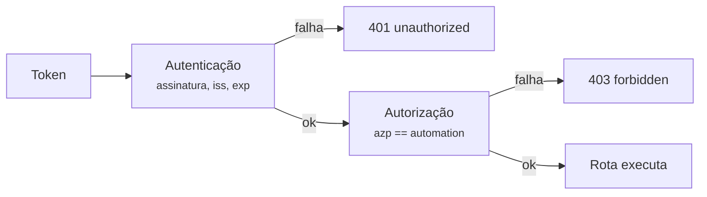

# Autenticação

`CASEHUB_AUTH_MODE` decide o que a API aceita em todas as rotas de
`/v1`. `/health` e `/ready` nunca exigem credencial.

| Modo | Aceita |
|---|---|
| `oidc` **(default)** | Só `Authorization: Bearer <JWT>`, validado contra o JWKS do issuer. |
| `dual` | Os dois — para migrar um consumidor por vez. |
| `apikey` *(legado)* | `X-API-Key` não vazia — **qualquer valor, sem validação real**. |

!!! danger "`apikey` não é autenticação"
    Qualquer string não vazia passa, e a autorização por automação **não
    se aplica** a esse método: uma chave qualquer lê e escreve casos de
    qualquer automação e qualquer ambiente. Só use atrás de rede
    fechada, nunca em produção.

    Foi o default até 2026-08-20, quando passou a `oidc`. Um ambiente
    que ainda dependa dele precisa declarar `CASEHUB_AUTH_MODE=apikey`
    explicitamente.

## Autenticação × autorização

São dois passos, e vale insistir na diferença:

- **Autenticação** responde *quem é você* — token válido, assinatura
  conferida contra o JWKS, `iss` e `exp` verificados.
- **Autorização** responde *o que você pode tocar* — o claim de
  automação do token precisa bater com a `automation` da chamada.

O segundo passo **só existe no método `oidc`**. É exatamente por isso
que `apikey` não serve como default: ele autentica sem escopo nenhum.



## O token

Precisa ser de um client `client_credentials` do Keycloak — automação
ou worker, nunca usuário interativo.

O claim que identifica a automação é `azp` por padrão
(`CASEHUB_OIDC_AUTOMATION_CLAIM`), presente em qualquer token de
`client_credentials` sem precisar de protocol mapper customizado. Na
prática: **o `client_id` do Keycloak precisa ser igual ao nome da
`automation`.**

!!! warning "Token sem o claim é 403, não acesso irrestrito"
    Um token OIDC válido mas sem o claim de automação (client mal
    configurado no Keycloak) é tratado como *sem permissão*. Falha
    fechada, sempre.

Apenas `RS256` é aceito, por allowlist explícita — o `alg` declarado no
header do token nunca é usado para escolher o algoritmo, o que fecha a
classe de ataque de confusão de algoritmo.

## Comportamento do modo `dual`

O modo existe para migrar consumidores um a um, e tem uma regra que
costuma surpreender:

!!! danger "Bearer recusado é 401, mesmo com `X-API-Key` presente"
    Um token inválido ou expirado enviado **junto** com uma chave
    responde 401 — não cai para `apikey`.

    Até 2026-08-20 caía, e a consequência não era só de autenticação: o
    contexto virava `apikey`, a autorização por automação deixava de se
    aplicar, e o cliente **perdia o escopo junto com o token**, passando
    a alcançar qualquer automação. Pior, a condição que disparava isso —
    as duas credenciais na mesma requisição — é exatamente o cenário
    para o qual o modo `dual` existe.

    Quem envia **apenas** `X-API-Key` continua aceito normalmente. O que
    mudou é que credencial ruim deixou de ser convite para tentar outra.

## Validação de `aud`

Com `CASEHUB_OIDC_AUDIENCE` **vazio** (default), a API não valida o
claim `aud`: qualquer token válido do mesmo issuer é aceito como
autenticação.

A autorização ainda segura o acesso — para alcançar uma automação é
preciso um token cujo `azp` seja exatamente o nome dela —, então a
exposição é estreita. Mas é uma camada a menos, e o serviço **avisa no
log de subida** enquanto estiver assim.

Para fechar, nesta ordem — inverter derruba os consumidores com 401:

1. Provisione um audience dedicado nos clients do Keycloak de cada
   ambiente (protocol mapper de *audience*), para os tokens passarem a
   carregar `aud`.
2. Preencha `CASEHUB_OIDC_AUDIENCE`. A validação passa a valer sozinha
   — não há mudança de código.
3. Confirme que os consumidores seguem autenticando.
4. Ligue `CASEHUB_OIDC_REQUIRE_AUDIENCE=true`: a partir daí o serviço
   **recusa subir** com o audience vazio, para a configuração não
   regredir em silêncio num deploy futuro.

## Configurando o SDK

=== "OIDC (recomendado)"

    ```python
    from casehub import CaseHubClient

    client = CaseHubClient(
        base_url='https://casehub.interno',
        client_id='triagem-nao-creditada',
        client_secret='...',
        token_url='https://keycloak.interno/realms/x/protocol/openid-connect/token',
    )
    ```

    Os três campos vêm juntos ou nenhum — configuração parcial falha na
    construção, antes de bater na rede.

=== "API key (legado)"

    ```python
    from casehub import CaseHubClient

    client = CaseHubClient(
        base_url='https://casehub.interno',
        api_key='...',
    )
    ```

!!! tip "OIDC tem precedência"
    Com os dois configurados, o SDK usa OIDC em toda chamada. Não é
    preciso apagar a `api_key` para migrar.
