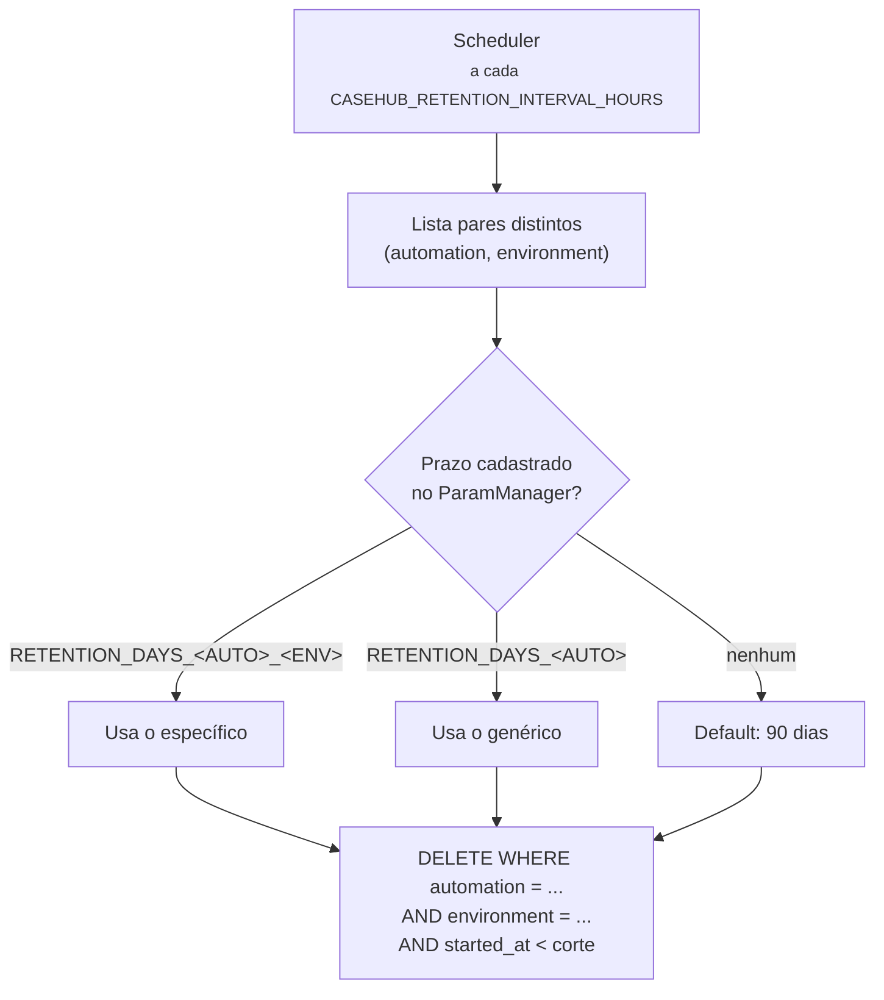

# Retenção

Um scheduler roda dentro do próprio processo da API e expurga casos
vencidos. Ele sobe e desce junto com a aplicação — não há worker
separado.

## Onde o prazo é configurado

No **ParamManager**, sob o namespace do próprio fast-casehub
(`CASEHUB_RETENTION_PARAM_MANAGER_APP_NAME`, default `casehub`) — não
no namespace de cada automação consumidora.

Precedência, e a primeira que existir vence:

1. `RETENTION_DAYS_<AUTOMATION>_<ENVIRONMENT>`
2. `RETENTION_DAYS_<AUTOMATION>`
3. Default de **90 dias**

O nome da automação é sanitizado para a convenção
`MAIUSCULO_COM_UNDERSCORE`: qualquer caractere fora de `[A-Z0-9_]` vira
`_`.

| `automation` | Parâmetro genérico | Por ambiente |
|---|---|---|
| `triagem-nao-creditada` | `RETENTION_DAYS_TRIAGEM_NAO_CREDITADA` | `RETENTION_DAYS_TRIAGEM_NAO_CREDITADA_DEV` |

## O expurgo é sempre escopado por ambiente

!!! danger "Por que isso importa"
    Mesmo quando **só** o prazo genérico está cadastrado, o `DELETE`
    filtra por `environment`.

    Sem esse escopo, um prazo curto configurado para limpar `dev`
    durante um teste apagaria também os casos de `prod` da mesma
    automação — silenciosamente, no ciclo seguinte do scheduler, com até
    24 horas de atraso entre a configuração e o dano.

## Falha não derruba o ciclo

Se o expurgo de um par `(automação, ambiente)` falhar — Postgres
instável, ParamManager fora do ar —, o erro é logado e o ciclo **segue
para o próximo**. Mesmo espírito do "erro por item não derruba o lote".

O ParamManager inacessível não é tratado como erro: `get_param` nunca
propaga exceção de rede, então esse caminho cai no default de 90 dias
junto com o caso normal de "parâmetro nunca cadastrado".

!!! warning "Consequência prática"
    Um ParamManager fora do ar faz **todas** as automações caírem nos 90
    dias, sem erro visível. Se você cadastrou um prazo menor e ele
    parece não estar valendo, verifique a conectividade com o
    ParamManager antes de suspeitar do parâmetro.

## Desligando

`CASEHUB_RETENTION_ENABLED=false` — nenhum scheduler é criado e nenhum
ParamManager é instanciado.

É o default em ambientes sem ParamManager acessível: a suíte de testes,
o CI e o profile `uat` do compose.

## Observabilidade

A cada execução, a métrica `casehub.retention.deleted` é incrementada
com os labels `automation` e `environment`.

!!! note "O label `environment` é novo"
    Ele foi adicionado quando o expurgo passou a ser escopado por
    ambiente. Consultas filtrando só por `automation` continuam
    funcionando, mas a série passou a ser dividida por ambiente — um
    painel que mostrava uma linha por automação agora mostra uma por
    automação × ambiente.
