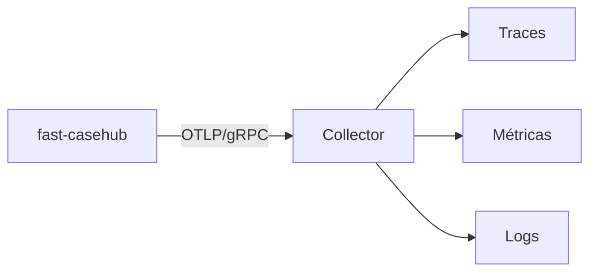

# Observabilidade

Traces, métricas e logs saem por **OTLP/gRPC** para um collector. A
configuração usa as variáveis padrão da especificação do OpenTelemetry,
lidas pelo próprio SDK — não há configuração própria em código.

| Variável | Para quê |
|---|---|
| `OTEL_EXPORTER_OTLP_ENDPOINT` | Endereço do collector. |
| `OTEL_SERVICE_NAME` | Nome do serviço nos traces. |
| `OTEL_RESOURCE_ATTRIBUTES` | Ex.: `deployment.environment=prod`. |
| `OTEL_SDK_DISABLED` | `true` desliga tudo — nenhum exporter é criado. |

`/health` e `/ready` são excluídos da instrumentação: probes de
liveness batem a cada poucos segundos e encheriam os traces de ruído
sem informação.

## Métricas

| Métrica | Labels | O que conta |
|---|---|---|
| `casehub.retention.deleted` | `automation`, `environment` | Casos expurgados por execução do job. |

!!! note "O label `environment` foi adicionado"
    Ele entrou quando o expurgo passou a ser escopado por ambiente.
    Consultas que filtram só por `automation` continuam funcionando —
    mas a série passou a ser dividida por ambiente, então um painel que
    mostrava uma linha por automação agora mostra uma por
    automação × ambiente.

## O que não aparece nos traces

!!! danger "`source_record` não é capturado, e isso é proposital"
    A instrumentação HTTP não captura corpo de requisição, e nenhum span
    ou log grava o conteúdo de `source_record`. Como ele pode carregar
    dado sensível, capturá-lo levaria esse dado para o backend de
    observabilidade — um lugar com política de acesso e retenção
    completamente diferentes das do banco.

    A decisão de produto sobre armazenar dado sensível cobre o
    **armazenamento**, não a observabilidade.

!!! warning "`CASEHUB_DB_ECHO=true` quebra isso"
    Ligar o echo do SQLAlchemy faz o SQL — com os parâmetros, incluindo
    o `source_record` — ir para o stdout. É útil em depuração local e
    **não deve ser ligado em ambiente compartilhado**.

Do mesmo modo, a resposta de erro 500 nunca carrega o detalhe da falha:
a exceção vai só para o log correlacionado. Ver
[Erros](../api/erros.md#erro-interno).

## Correlação

Logs saem correlacionados por `trace_id`/`span_id`, então um erro
observado no log leva ao trace completo da requisição.

Para correlacionar com o Temporal, os campos `temporal_workflow_id` e
`temporal_run_id` do caso ligam o registro à execução que o produziu.
São opcionais e não têm chave estrangeira — servem para investigação,
não para integridade referencial.

## O que observar

| Sinal | Por que importa |
|---|---|
| `/ready` respondendo 503 | O banco caiu; o serviço está de pé mas inutilizável. |
| Taxa de 401/403 | Token expirado, client mal provisionado ou automação tentando escopo alheio. |
| `errors[]` não vazio nos lotes | Falha **do lado do publicador** — não aparece como erro HTTP. |
| Aviso de `aud` na subida | O serviço está aceitando qualquer token do issuer. Ver [Autenticação](../api/autenticacao.md#validacao-de-aud). |
| `casehub.retention.deleted` fora do esperado | Prazo mal configurado, ou ParamManager inacessível fazendo tudo cair no default de 90 dias. |

!!! danger "Lote com item recusado não gera erro HTTP"
    É o ponto cego mais comum: o painel de erros 5xx fica limpo enquanto
    casos são descartados. Se você monitora só status HTTP, não está
    monitorando a publicação — instrumente `errors[]` do lado do
    publicador.
